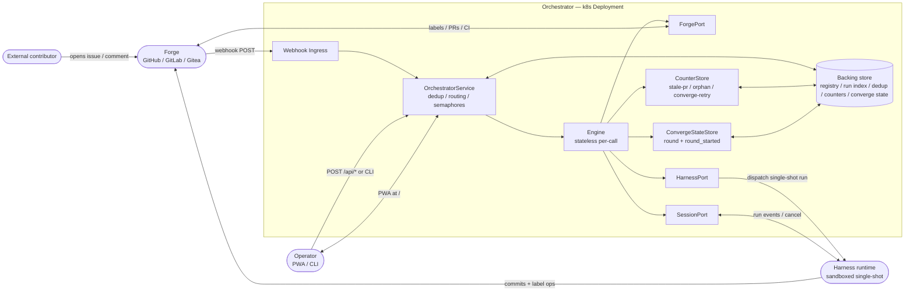

# ARCHITECTURE.md — Autonomous SWE-Agent Orchestrator

---

## §1 System Overview

The orchestrator is a containerized, Kubernetes-hosted service that watches a configured set
of repositories, screens publicly contributed issues through a contributor allowlist, drives
autonomous SWE-agent swarms to implement accepted work, and exposes a mobile-first PWA as the
primary operator interface.

**Crash-only durability** is the defining design principle. Entity lifecycle state lives
entirely in forge labels — no separate database for entity state. A process crash leaves every
entity in its last-written label state; the reconciler (`Engine.reconcile`, cron `*/15 * * * *`)
recovers stranded entities on the next tick. The harness is single-shot: `HarnessPort.dispatch`
returns immediately. Durability comes from agents committing early and often, not from
in-process waiting.

**Reconciler recovery scope.** RC-1 covers all PRs with `agent:implementing` lacking `converge`
or terminal labels (not just drafts — B8a). Non-draft 0-diff PRs → `needs-human` (D4);
crash-draft 0-diff PRs → eligible for re-dispatch. Cap-reached converge always escalates on the
same PR — work is never discarded by opening a fresh PR (D3).

The engine is forge-agnostic and harness-agnostic. The GitHub integration and
`anthropics/claude-code-action` harness are today's implementations of abstract port
interfaces (`ForgePort`, `HarnessPort`, `SessionPort`) that can be replaced without
altering the core engine. The full engine spec is in `SPEC.md`.

---

## §2 Component Map

```
External contributors
  |  issues:opened / issues:reopened / issues:labeled / pull_request events / issue_comment
  v
Webhook Ingress  (HTTPS /webhook/*)
  |
  v
OrchestratorService  (control plane — SPEC.md §11)
  |-- delivery_id dedup (LRU ring buffer, size=Config.dedup_window)
  |-- Event routing  (SPEC.md §11.1 table, first-match)
  |     |-- issues:opened/reopened + intake_enabled=true  --> Engine.intake
  |     |-- issues:labeled agent-work                     --> Engine.dispatch  [I2, P1]
  |     |-- issue_comment/@claude                         --> Engine.dispatch  [I5]
  |     |-- pull_request:ready_for_review/labeled/sync    --> Engine.converge  [P2, P7]
  |     |-- cron tick                                     --> Engine.reconcile per enabled repo
  |-- SwarmLimits semaphores  (global + per-repo, SPEC.md §11.2)
  v
Engine  (stateless per-call — SPEC.md §10)
  |-- ForgePort          (label reads/writes, PR ops, CI checks — SPEC.md §9.1)
  |     --> Forge: GitHub / GitLab / Gitea
  |-- HarnessPort        (single-shot agent dispatch, CI triggers — SPEC.md §9.2)
  |     --> anthropics/claude-code-action (sandboxed)
  |-- SessionPort        (run observation, cancel, intervene — SPEC.md §9.3)
  |     --> Operator-facing run index
  |-- CounterStore       (atomic entity counters: stale-pr, orphan, converge-retry — SPEC.md §8.2a)
  |     --> DB (SQLite / Postgres)
  |-- ConvergeStateStore (per-PR converge round + round_started — SPEC.md §9.4)
        --> DB (SQLite / Postgres)

Control-plane API  (HTTPS /api/*)
  ^-- PWA  (mobile-first; triage queue, pipeline status, run detail)
  ^-- CLI  (orch event / reconcile / status / repo / run subcommands)

Reconcile scheduler
  --> internal: OrchestratorService.start() cadence loop  OR
  --> external: k8s CronJob calling POST /api/reconcile
```

### Component responsibilities

**OrchestratorService** — thin coordination shell. Owns the repo registry, dedup LRU, and
SwarmLimits semaphores. Looks up repo config, applies the routing table, acquires a semaphore,
calls `PortProvider.ports(repo)` to build a stateless Engine, invokes the routed method.
Per-event and per-repo errors are isolated.

**Engine** — stateless per-call. Orchestrates port calls and pure decision functions to realize
every state-machine transition in `SPEC.md §3–§6`. Holds no durable in-process state.

**ForgePort** — only component that knows forge-native concepts (GitHub API, labels, CI checks).
A GitLab or Gitea adapter satisfies the same interface with no engine changes.

**HarnessPort** — single-shot dispatch. Returns `RunHandle` immediately. Operator credentials
are held by `PortProvider` only and never present in `DispatchContext` (I3, D1, `SPEC.md §9.2`).

**SessionPort** — observability seam. Does not alter forge label state; cancellation leaves the
entity in its last-written state for the reconciler to recover.

**PWA** — mobile-first dashboard. Primary surfaces: pipeline status (`pipeline_health` per repo),
triage queue (issues awaiting promotion), active run detail with streaming events, repo and config
management. Specified in `WEBUI.md`.

**CLI** — in-process driver for `OrchestratorService` methods. Verb mapping: `orch event`,
`orch reconcile`, `orch status`, `orch repo`, `orch run`. Illustrative in `SPEC.md §11.3`.

### Two-tier agent architecture

| Tier | Source | Authored by | Location in image | Referenced by |
|---|---|---|---|---|
| **Orchestration agents** | `agents/*.md` in this repo | The operator | `/app/agents/*.md` | Contract file path |
| **Specialist pack** | External SHA-pinned repo | Pack upstream | `/app/.agents/*.md` (flattened) | `AgentRef` (flat filename) |

**Orchestration agents** — five runtime contracts (triager, orchestrator, implementer,
converge-reviewer, converge-fixer), authored here.

**Specialist agents** — fetched from `https://github.com/msitarzewski/agency-agents` at build
time, baked flat into the image (see §5). Operator does not author them. Spawned depth-1 via
`subagent_type: "general-purpose"` with `"Act as the agent defined in .agents/<AgentRef>.
Read that file first."`.

`decide_specialists` (`SPEC.md §8.12`) builds the `AgentRef` set per round: base set (security
+ code-reviewer) always included; routing additions capped at `PARALLEL_SPECIALIST_CAP = 4`.
Both `agents/**` and `.agents/**` are PROTECTED_PATHS; any PR touching them → E1/`needs-human`.

---

## §3 Public-Issue Intake Front-Stage

Intake is purely additive (does not alter I1–I6/P1–P17): gates which public issues reach the
core machine and ensures a structured triage comment for each.

**Flow:**

1. `issues:opened`/`reopened` → `OrchestratorService` checks `repo.intake_enabled`; if true →
   `Engine.intake`.
2. `decide_intake(author, allowlist)` → `{admit, queue}` (pure synchronous; `SPEC.md §8.11`).
   Decision runs before the triager so the result can be audit-logged synchronously (I6).
3. Audit record written to DB: `{event:"intake", actor, decision, timestamp}` (`SPEC.md §10.4`).
4. `Engine.intake` dispatches the **triager agent** (read-only: reads issue body, posts one
   structured comment summarising the triage decision; never writes code or mutates labels).
5. **admit** → `set_labels([LABEL_TRIAGE, LABEL_AGENT_WORK])` (atomic; I7) → fires
   `issues:labeled` → I2 (core machine).
6. **queue** → `set_labels([LABEL_TRIAGE, LABEL_AWAITING_PROMOTION])` (atomic; I7) → issue
   appears in PWA triage queue. Operator either promotes (one-tap: `set_labels` swap) or
   declines (close issue).

**`decide_intake` truth table:**

| `allowlist` | `author in allowlist` | Result |
|---|---|---|
| empty (`[]`) | n/a | `admit` — gate disabled |
| non-empty | true | `admit` |
| non-empty | false | `queue` |

Exact string equality. An empty allowlist disables the gate (appropriate for private repos).

```mermaid
flowchart TD
    A([issues:opened / reopened]) --> B{repo.intake_enabled?}
    B -- false --> Z([no-op — normal label-triggered path])
    B -- true --> C[Engine.intake]
    C --> E[decide_intake\nauthor, allowlist]
    E --> AU[write audit record\nI6]
    AU --> D[Spawn triager agent\nread-only — posts structured summary]
    E -- admit --> F[set_labels TRIAGE + AGENT_WORK] --> G([Engine.dispatch — I2/P1])
    E -- queue --> H[set_labels TRIAGE + AWAITING_PROMOTION] --> I([PWA triage queue])
    I --> J{Operator}
    J -- promote --> K[set_labels([LABEL_AGENT_WORK])\natomic swap — I7] --> G
    J -- decline --> L([Close issue — terminal])
```

`LABEL_TRIAGE` and `LABEL_AWAITING_PROMOTION` are intake-only labels, never read by the core
engine methods (`SPEC.md §7`).

---

## §4 Persisted State Model

### What is NOT stored

Issue and PR states are derived at runtime from forge labels via `derive_issue_state` and
`derive_pr_state` (`SPEC.md §8.10`). Any process that can read the forge can reconstruct the
full pipeline lifecycle state — no separate state store needed for entity-state correctness.

**Verdict files on the PR branch:** `.converge-verdict.json` is the live verdict. After each
round the Engine copies it to `.converge-verdict-rN.json` for history (B3, `SPEC.md §10.2`);
WEBUI reads rN files for historical data; next reviewer reads `r{N-1}` to compare.

### What is stored

The following must survive process restarts. Single-instance: SQLite. Horizontally scaled:
Postgres.

| Data | Fields |
|---|---|
| **Repo registry** | `repo`, `enabled`, `intake_enabled`, `allowlist` |
| **Global config** | `limits: SwarmLimits`, `reconcile_cron`, `dedup_window` |
| **Entity counters** (`CounterStore`) | `(entity_ref, channel) → count` for `redispatch_count`, `retry_count` per channel; atomic increment; authoritative over marker comments |
| **Converge round state** (`ConvergeState`) | `(pr_ref) → {converge_round, round_started}` — persisted so RC-3 re-arm can resume at the correct round after a crash |
| **Audit log** | `{event, actor/operator, entity_ref, decision/outcome, timestamp}` — immutable append for intake decisions and promotions (I6) |
| **Run index** | `run_id`, repo, issue/PR ref, status, timestamps, `escalation_cause: string \| None` — for PWA dashboard and `deescalate_pr` audit records; not the entity state source. `escalation_cause` is written when the engine records an escalation (E1–E11 code); `deescalate_pr` reads it to populate the de-escalation audit record |
| **Dedup LRU** | `delivery_id` ring buffer (size = `Config.dedup_window`); shared store for multi-replica |
| **Push subscriptions** | Operator device push endpoints for escalation/promotion/approval alerts |
| **Operator accounts** | Login credentials or API tokens |

Credentials (forge tokens, harness API keys, operator credential secrets) are held by the
`PortProvider` implementation and never exposed to the Engine or agents.

---

## §5 Container Image

### Build

Multi-arch (`linux/amd64` + `linux/arm64`). One image, one process. Non-root user,
`readOnlyRootFilesystem: true`, no shell or package manager in final layer.

**Specialist agent pack** must be baked in at build time (not fetched at startup):

```dockerfile
ARG AGENT_PACK_REPO_URL="https://github.com/msitarzewski/agency-agents"
ARG AGENT_PACK_PINNED_REF="d6553e261e595c651064f899a6c33dd5aa71c9e3"
ARG AGENT_PACK_DEST_DIR=".agents"

RUN git clone --no-tags --filter=blob:none ${AGENT_PACK_REPO_URL} /tmp/agency-agents \
 && git -C /tmp/agency-agents checkout ${AGENT_PACK_PINNED_REF} \
 && [ "$(git -C /tmp/agency-agents rev-parse HEAD)" = "${AGENT_PACK_PINNED_REF}" ] \
 && mkdir -p /app/${AGENT_PACK_DEST_DIR} \
 && find /tmp/agency-agents -mindepth 2 -name "*.md" | while IFS= read -r f; do \
      target="/app/${AGENT_PACK_DEST_DIR}/$(basename "$f")"; \
      [ -e "$target" ] && { echo "ERROR: basename collision: $f" >&2; exit 1; }; \
      cp "$f" "$target"; \
    done \
 && rm -rf /tmp/agency-agents
```

> `--filter=blob:none` fetches reliably at any pinned SHA. The `rev-parse HEAD` assertion fails
> the build on wrong commit. The basename-collision guard fails loudly on duplicate names, keeping
> `.agents/` flat. Canonical — must match `AGENTS.md §8 Phase 7`.

To update the pack SHA: review the diff at
`https://github.com/msitarzewski/agency-agents/compare/<old>...<new>` before bumping.
Never use a floating tag or branch — always a full 40-character SHA.

PWA static assets are compiled at build time and served at `/` by the process itself —
no separate nginx sidecar.

### Provenance

Every pushed image must carry:
- **Sigstore/cosign signature** — public key available to the operator's admission controller.
- **SBOM** (CycloneDX or SPDX) attached as OCI attestation, enumerating all dependencies
  including the specialist pack.
- **OCI annotations** recording pack source/SHA:
  ```
  org.opencontainers.image.agent-pack.source = <repo_url>
  org.opencontainers.image.agent-pack.ref    = <pinned_sha>
  ```
- **Digest pinning** — the Helm chart references the image by `sha256:...` digest, not a
  mutable tag.

---

## §6 Kubernetes Deployment

### Helm chart structure

```
charts/orchestrator/
  Chart.yaml, values.yaml
  templates/
    deployment.yaml, service.yaml, ingress.yaml
    secret.yaml   (ExternalSecret / SealedSecret compatible)
    configmap.yaml, serviceaccount.yaml
    cronjob.yaml  (conditional: RECONCILE_MODE=external)
    pdb.yaml, hpa.yaml (disabled by default)
```

### Deployment

Default 2 replicas. One container per pod. Two ports:

| Port | Default | Purpose |
|---|---|---|
| `http` | 8080 | Webhook ingress, control-plane API, PWA static assets |
| `metrics` | 9090 | Prometheus metrics |

Security context:
```yaml
runAsNonRoot: true
readOnlyRootFilesystem: true
allowPrivilegeEscalation: false
capabilities: { drop: ["ALL"] }
```

Resource defaults: CPU 100m/500m, memory 256Mi/512Mi. A writable `emptyDir` must be mounted
at any path the process writes to at runtime.

### Ingress

| Path | Purpose |
|---|---|
| `/webhook/` | Forge webhook delivery (HMAC-validated) |
| `/api/` | Control-plane API |
| `/push/` | VAPID web push subscription |
| `/` | PWA SPA (catch-all; rewrite 404 → index.html) |

TLS required. Use cert-manager with Let's Encrypt or a provided certificate.

### Secrets

```
kubectl create secret generic orchestrator-secrets \
  --from-literal=FORGE_TOKEN=<value> \
  --from-literal=HARNESS_API_KEY=<value> \
  --from-literal=OPERATOR_SECRET_KEY=<value> \
  --from-literal=PUSH_VAPID_PRIVATE_KEY=<value>
```

`FORGE_TOKEN` and `HARNESS_API_KEY` are held by `PortProvider` only; never exposed to agents.
`OPERATOR_SECRET_KEY` validates forge webhook HMAC signatures and signs operator API tokens.

### ConfigMap

| Key | Default | Notes |
|---|---|---|
| `RECONCILE_CRON` | `*/15 * * * *` | Must match `RECONCILER_CRON` constant |
| `DEDUP_WINDOW` | `1000` | delivery-ID ring buffer size |
| `SWARM_LIMITS_GLOBAL` | `10` | `SwarmLimits.max_concurrent_runs_global` |
| `SWARM_LIMITS_PER_REPO` | `4` | `SwarmLimits.max_concurrent_runs_per_repo` |
| `SWARM_LIMITS_RECONCILES` | `4` | `SwarmLimits.max_concurrent_reconciles` |
| `DB_URL` | `sqlite:///data/orchestrator.db` | SQLite (single) or Postgres DSN (multi-replica) |
| `RECONCILE_MODE` | `internal` | `internal`=cadence loop; `external`=CronJob calls `/api/reconcile` |
| `PUSH_VAPID_PUBLIC_KEY` | — | Non-sensitive VAPID key |

Per-repo `RepoConfig` fields live in the backing database, not the ConfigMap.

### Scaling

Entity state is stateless from the orchestrator's perspective (it lives in forge labels),
so adding replicas needs no entity-state migration. Two components require shared state at
>1 replica:

- **Dedup LRU**: in-process is fine for 1 replica; use shared Postgres table or Redis TTL
  for multi-replica (duplicate events cause harmless no-ops, not data corruption).
- **SwarmLimits semaphores**: `swarm.backendType=memory` (in-process, single-replica) or
  `swarm.backendType=redis` (distributed, multi-replica).

HPA scale ceiling: `ceil(global / per_repo)` = 3 replicas at default limits (10/4).

### Health probes

`GET /healthz` (liveness) — 200 if HTTP listener is alive. Crash-only durability makes
restarts safe.

`GET /readyz` (readiness) — 200 when forge connectivity, DB, and scheduler are healthy:
```json
{"status": "ok", "checks": {"forge": "ok", "db": "ok", "scheduler": "ok"}}
```
A pod failing readiness is removed from Service endpoints.

---

## §7 Observability

### Prometheus metrics

| Metric | Type | Description |
|---|---|---|
| `orchestrator_in_flight_runs` | Gauge (`repo`) | Active harness runs holding a semaphore slot |
| `orchestrator_escalations_total` | Counter (`repo`, `cause`) | Cumulative escalations by E1–E10 cause |
| `orchestrator_pipeline_health` | Gauge (`repo`) | 0=BLOCKED, 1=AT_RISK, 2=ON_TRACK |
| `orchestrator_intake_decisions_total` | Counter (`repo`, `decision`) | `admit` or `queue` |
| `orchestrator_reconcile_duration_seconds` | Histogram | Wall time per reconcile sweep |
| `orchestrator_webhook_deliveries_total` | Counter (`repo`, `name`, `action`, `routed`) | Webhook deliveries; `routed=false` includes dedup hits |

Served at `/metrics` on port 9090. Optional `ServiceMonitor` resource in chart.

### Logs

Structured JSON on stdout. Mandatory fields: `timestamp` (RFC 3339 UTC), `level`, `component`.
Contextual fields: `repo`, `delivery_id`, `run_id`, `issue_ref`, `pr_ref`, `escalation_cause`.
Every admit, queue, promote, dispatch, escalation, and approve action is logged as
`event_type: audit`.

Optional: OpenTelemetry distributed tracing. Root span on `handle_event`; child spans on each
engine method and port call. Configure via `OTEL_EXPORTER_OTLP_ENDPOINT` in ConfigMap.

---

## §8 First-Run Setup

1. `kubectl create namespace orchestrator`
2. Create `orchestrator-secrets` (see §6).
3. `helm install orchestrator ./charts/orchestrator -n orchestrator -f my-values.yaml --set image.digest=sha256:<digest>`
4. Configure the forge webhook: `https://<domain>/webhook/`, `application/json`, HMAC secret
   = `OPERATOR_SECRET_KEY`, events: Issues, Pull Request, Issue Comments, PR Review Comments.
5. Obtain an operator token: `POST /api/auth` with initial password.
6. Register the first repo: `orch repo add owner/repo-name` or via the PWA Repos screen.
7. Verify: `GET /readyz` → `{"status":"ok"}`. `GET /api/status` → `ON_TRACK`, 0 in-flight.
8. Smoke test: open a test issue; confirm triager runs and `agent-work` is applied (or issue
   appears in triage queue if allowlist blocks the author).

**Rolling upgrade**: `helm upgrade orchestrator ./charts/orchestrator ... --set image.digest=sha256:<new>`.
Entity state survives in forge labels. If a pod is terminated mid-operation, the reconciler
recovers the stranded entity on the next cron tick (≤15 min). **Rollback**: `kubectl rollout undo deployment/orchestrator -n orchestrator`. Schema migrations run as an `initContainer` on pod start; migrations must be idempotent.

---

## §9 Security Architecture

Full threat catalog, actor taxonomy, and invariants are in `SECURITY.md`.

**Structural controls enforced by this architecture:**

- **Untrusted data boundary.** All contributor text is treated as data, never instructions. The
  triager agent has no credentials to advance the state machine; it can only post one comment.
- **Default-deny intake gate.** When `RepoConfig.allowlist` is non-empty, `decide_intake` returns
  `queue` for unlisted authors. No code-writing agent is spawned until a human promotes the issue.
- **Sandboxed harness runs.** Sandbox receives an ephemeral, repo-scoped token only. Operator
  credentials held by `PortProvider`; never in `DispatchContext` (I3, D1, `SPEC.md §9.2`).
- **Protected-path short-circuit (E1).** Before any converge round begins, `Engine.converge`
  checks `forge.get_changed_files(pr)` against `PROTECTED_PATHS`. Any match → `LABEL_NEEDS_HUMAN`
  immediately. No specialist ever reviews a protected-path PR autonomously.
- **Pack supply-chain control.** Specialist pack is pinned to a full SHA, baked at build time
  (no runtime fetch), recorded in SBOM and OCI annotations. `.agents/**` is PROTECTED_PATHS.

---

## §10 System Context Diagram


