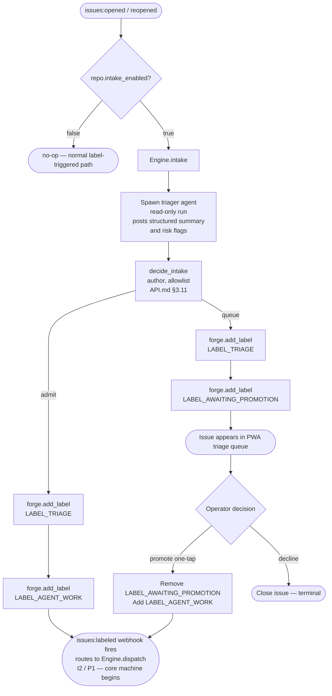
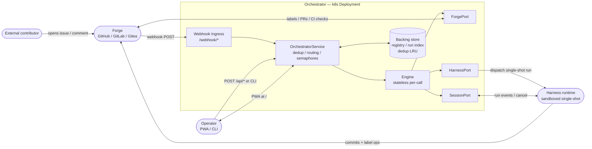

# ARCHITECTURE.md — Autonomous SWE-Agent Orchestrator

**Version**: 1.0
**Date**: 2026-06-20
**Status**: Draft
**Depends on**: `STATE_MACHINE.md` 1.0, `DECISION_LOGIC.md` 1.0, `API.md` 1.0

---

## §1 System Overview

This system is a containerized, Kubernetes-hosted orchestrator that watches a configured set
of source repositories, accepts publicly contributed issues through a contributor allowlist,
drives autonomous SWE-agent swarms to implement accepted work, and exposes a mobile-first
progressive web application as its primary operator interface. It is designed to be
forge-agnostic and harness-agnostic: the concrete GitHub integration and the
`anthropics/claude-code-action` harness are today's implementations of abstract port
interfaces that can be replaced without altering the core engine.

The state machine that governs all entity lifecycle is specified in `STATE_MACHINE.md`.
Two long-lived entity types move through it — Work Items (issues) and Change Sets (pull
requests) — and their state is encoded entirely in forge labels, with no separate database
for entity state. The full service contract, including the three abstract ports
(`ForgePort`, `HarnessPort`, `SessionPort`), the `Engine`, and the `OrchestratorService`
control-plane wrapper, is specified in `API.md`. This document is the architectural view
that maps those specs onto running components, deployment topology, and operational concerns.

Crash-only durability is the defining design principle. The engine holds no in-process
durable state: if the process crashes mid-converge, every entity remains in its
last-written label state in the forge, and the reconciler (`Engine.reconcile`) detects and
recovers stranded entities on the next cron tick (`RECONCILER_CRON = "*/15 * * * *"`,
`API.md §2` Constants). Agents are therefore required to commit early and often — their
file changes survive process death because they are in the git history, not in process
memory (`STATE_MACHINE.md §1`, `API.md §6`). There is no resume path; single-shot harness
runs that do not commit before dying are recovered by re-dispatch.

---

## §2 Component Map

### 2.1 Diagram

```
External contributors
  |
  | issues:opened / issues:reopened / issues:labeled
  | pull_request events / issue_comment events
  v
Webhook Ingress  (HTTPS /webhook/*)
  |
  v
OrchestratorService  (control plane — API.md §8.4)
  |
  |-- delivery_id dedup (LRU ring buffer, size = Config.dedup_window)
  |
  |-- Event routing  (API.md §8.3 table, first-match)
  |     |
  |     |-- issues:opened/reopened + intake_enabled=true
  |     |     --> Engine.intake(event)           [triage front-stage; §3 below]
  |     |
  |     |-- issues:labeled + label=agent-work
  |     |     --> Engine.dispatch(event)         [I2, P1]
  |     |
  |     |-- issue_comment / pr_review_comment + @claude
  |     |     --> Engine.dispatch(event)         [I5]
  |     |
  |     |-- pull_request:ready_for_review
  |     |-- pull_request:labeled + label=converge
  |     |-- pull_request:synchronize
  |     |     --> Engine.converge(pr_ref)        [P2, P7]
  |     |
  |     |-- cron tick (reconcile_cron schedule)
  |           --> Engine.reconcile(repo) per enabled repo  [RC-1..RC-4]
  |
  |-- SwarmLimits semaphores  (global + per-repo, API.md §8.2)
  |
  v
Engine  (stateless per-call — API.md §5)
  |
  |-- ForgePort    (label reads/writes, PR ops, CI check reads — API.md §4.1)
  |     --> Forge: GitHub / GitLab / Gitea
  |
  |-- HarnessPort  (single-shot agent dispatch, CI triggers — API.md §4.2)
  |     --> Harness runtime: anthropics/claude-code-action (sandboxed)
  |
  |-- SessionPort  (run observation, cancel, intervene — API.md §4.3)
        --> Operator-facing run index

Control-plane API server  (HTTPS /api/*)
  ^
  |-- PWA  (mobile-first; triage queue, pipeline status, run detail)
  |-- CLI  (orch event / reconcile / status / repo / run subcommands)

Reconcile scheduler
  --> internal cadence loop (OrchestratorService.start()) OR
  --> external k8s CronJob calling POST /api/reconcile or `orch reconcile`
```

### 2.2 Component responsibilities

**Webhook Ingress**
Receives forge webhook POST requests at `/webhook/*` and normalizes them into `ForgeEvent`
records (`API.md §8.1`). Validates forge signatures. Passes each event immediately to
`OrchestratorService.handle_event`.

**OrchestratorService**
The thin coordination shell (`API.md §8.4`) that owns the in-memory repo registry, the
`delivery_id` LRU dedup cache, and the `SwarmLimits` semaphores. For each event it looks up
the repo config, applies the routing table (`API.md §8.3`), acquires a semaphore slot,
calls `PortProvider.ports(repo)` to build a stateless `Engine`, invokes the routed engine
method, and releases the slot. Per-event and per-repo errors are isolated: a forge outage
on one repo must not abort the reconcile sweep of others (`API.md §8.5`).

**Engine**
Stateless per-call (`API.md §5`). Constructed with `(ForgePort, HarnessPort, SessionPort)`.
Exposes four async methods: `dispatch`, `converge`, `reconcile`, and `intake`. Orchestrates
calls to the ports and the pure decision functions (`API.md §3`) to realize every
state-machine transition in `STATE_MACHINE.md §3–§5`. Holds no durable in-process state —
all state lives in forge labels.

**ForgePort**
Abstract interface for all forge operations: label mutations, PR lifecycle, CI check reads,
comment and review posting, file-change enumeration (`API.md §4.1`). The only component
that knows forge-native concepts. Today's implementation targets GitHub; a GitLab or Gitea
adapter would satisfy the same interface without touching the engine or decision functions.

**HarnessPort**
Abstract interface for single-shot agent dispatch and CI triggering (`API.md §4.2`).
`dispatch` returns a `RunHandle` immediately; the engine never blocks awaiting the agent.
Today's implementation wraps `anthropics/claude-code-action`, which runs sandboxed with no
forge tokens or harness API keys in the agent environment (see `§8 Security`).

**SessionPort**
Observability seam for the operator control plane (`API.md §4.3`). Provides run listing,
real-time event streaming, cancellation, and mid-run intervention. Does not alter forge
label state; cancellation leaves the entity in its last-written state and the reconciler
recovers it on the next tick. Not implemented in the reference implementation; part of the
roadmap.

**PWA (Progressive Web Application)**
Mobile-first operator dashboard served as static assets at `/`. Primary surfaces: pipeline
status (`pipeline_health` verdicts per repo — `DECISION_LOGIC.md §9`), triage queue
(issues in `awaiting-promotion` state awaiting human promotion or decline), active run
detail with streaming events, and repo and config management. Config-CRUD endpoints
extending `API.md §8.4` are specified in `WEBUI.md`.

**CLI**
In-process driver for `OrchestratorService` methods. Verb mapping is illustrative in
`API.md §8.6`: `orch event`, `orch reconcile`, `orch status`, `orch repo`, `orch run`.
Used for scripted deployments, on-call intervention, and CI-triggered reconcile calls from
external schedulers.

**Reconcile Scheduler**
Fires `Engine.reconcile(repo)` for each enabled repo on the `reconcile_cron` schedule.
Realized either as an internal cadence loop (`OrchestratorService.start()`) or as an
external Kubernetes CronJob calling `POST /api/reconcile` or `orch reconcile`. Both are
equivalent; the external CronJob is preferred in environments that already have a k8s
scheduler (see `§5 Deployment`).

### 2.3 Two-tier agent architecture

The orchestrator uses **two tiers of agents** that must not be confused:

| Tier | Source | Who authors | Location in image | How identified |
|---|---|---|---|---|
| **Orchestration agents** | This repo (`agents/*.md`) | The operator (us) | `/app/agents/*.md` | By contract file path |
| **Specialist pack** | External SHA-pinned repo (see `AGENT_PACK.md`) | Pack upstream | `/app/.agents/*.md` (flattened) | By `AgentRef` (flat filename) |

**Orchestration agents** are the contracts injected by the harness at the top of each
workflow: the triager (`agents/triager.md`), the dispatch orchestrator
(`agents/orchestrator.md`), the implementer (`agents/implementer.md`), the converge reviewer
aggregator (`agents/converge-reviewer.md`), and the converge fixer (`agents/converge-fixer.md`).
These are authored and versioned in this repository. They are the analogues of the `mirror`
reference implementation's `.agents/custom/*.md` contracts.

**Specialist agents** are definitions from an external, SHA-pinned agent-pack repository
(`https://github.com/msitarzewski/agency-agents`) that is fetched and flattened into the
container image **at build time** (`DEPLOYMENT.md §2`, `AGENT_PACK.md §3`). The operator
does **not** author specialists. The pack contains category-organized specialist prompts
(security engineer, code reviewer, database optimizer, accessibility auditor, API tester, …).
Specialists are spawned by orchestration agents using `subagent_type: "general-purpose"` with
the prompt *"Act as the agent defined in `.agents/<AgentRef>`. Read that file first."* They
run at depth-1 only and do not spawn further sub-agents.

The **selection function** `decide_specialists` (`API.md §3.12`) is a pure synchronous
function that maps a PR's changed-file paths to the appropriate set of `AgentRef` values for
a converge review round. It always includes the base set (security + code-quality reviewers)
and adds diff-path-matched specialists from `SPECIALIST_ROUTING` (`API.md §2`), capped at
`PARALLEL_SPECIALIST_CAP = 4`.

The pack directory (`.agents/`) and the orchestration-agent contracts (`agents/`) are both
`PROTECTED_PATHS` entries (`API.md §2`): any PR that modifies them triggers an E1 escalation
before any specialist runs. This closes the agent-pack poisoning vector
(`THREAT_MODEL.md §2 T5`, `T8`).

---

## §3 Public-Issue Intake Front-Stage  {#intake}

### 3.1 Design principle

The intake front-stage is purely additive. It does not modify any state-machine transition
— I1–I6 and P1–P17 are unchanged (`STATE_MACHINE.md §3`). Its sole purpose is to gate
which publicly contributed issues are admitted to the core machine and to ensure every
admitted issue receives a structured triage comment before any code-writing agent is
dispatched.

The core machine begins at I1: an issue carrying `LABEL_AGENT_WORK` is QUEUED. Intake
decides whether to apply that label immediately (admit) or hold the issue for human
promotion (queue). When `repo.intake_enabled == false`, the front-stage is bypassed
entirely; issues with `LABEL_AGENT_WORK` applied by a human or automation dispatch
normally (`API.md §8.2`, `RepoConfig`).

### 3.2 Flow

1. A `issues:opened` or `issues:reopened` webhook arrives. `OrchestratorService` checks
   `repo.intake_enabled`; if `true`, it routes to `Engine.intake(event)` (`API.md §8.3`).

2. `Engine.intake` spawns the **triager agent** via `HarnessPort.dispatch`. The triager is
   a read-only run: it never writes code, never opens a PR, and never mutates forge label
   state. It reads the issue body and repository context, then posts a structured comment
   containing a plain-language summary and risk flags. The full triager contract is in
   `agents/triager.md`.

3. `Engine.intake` calls `decide_intake(author, allowlist)` — a pure synchronous function
   (`API.md §3.11`). The allowlist comes from `RepoConfig.allowlist`.

4. On **admit** outcome:
   - `forge.add_label(issue, LABEL_TRIAGE)` — marks triage complete.
   - `forge.add_label(issue, LABEL_AGENT_WORK)` — transitions issue to QUEUED (I1).
   - The resulting `issues:labeled` webhook fires and routes to `Engine.dispatch` (I2, P1).

5. On **queue** outcome:
   - `forge.add_label(issue, LABEL_TRIAGE)` — marks triage complete.
   - `forge.add_label(issue, LABEL_AWAITING_PROMOTION)` — holds the issue.
   - The issue appears in the PWA triage queue. The operator either promotes it (one-tap
     adds `LABEL_AGENT_WORK`, which fires `issues:labeled` → I2 → dispatch) or declines
     it (closes the issue). No code-writing agent is ever reached without human promotion.

### 3.3 `decide_intake` truth table

(`API.md §3.11`; reproduced here for architectural completeness.)

| `allowlist` | `author in allowlist` | Result |
|---|---|---|
| empty (`[]`) | n/a | `admit` — gate disabled; all authors admitted |
| non-empty | `true` | `admit` |
| non-empty | `false` | `queue` |

**Default-deny guarantee**: when the allowlist is non-empty, every unlisted author is
queued. No code-writing agent is reached without explicit human promotion. An empty
allowlist disables the gate entirely, which is the appropriate setting for private or
fully-trusted repositories.

### 3.4 Intake state machine (Mermaid)



### 3.5 Relationship to the label vocabulary

`LABEL_TRIAGE` and `LABEL_AWAITING_PROMOTION` are intake-only labels. They are never read
by `Engine.dispatch`, `Engine.converge`, or `Engine.reconcile`. The core machine's label
vocabulary — `LABEL_AGENT_WORK`, `LABEL_NEEDS_HUMAN`, `LABEL_IMPLEMENTING`,
`LABEL_CONVERGE`, `LABEL_READY` — is unmodified by the intake front-stage
(`API.md §2`, label vocabulary).

---

## §4 Persisted State Model

### 4.1 What is NOT stored

Entity state is not stored in any database. Issue states (QUEUED, ESCALATED, CLOSED) and
PR states (BUILDING, CONVERGING, APPROVED, ESCALATED, MERGED, EMPTY) are derived at
runtime from forge labels via `derive_issue_state` and `derive_pr_state`
(`API.md §3.10`). Converge round counts and verdict history live in
`.converge-verdict.json` and `.converge-verdict-rN.json` files on the PR branch
(`STATE_MACHINE.md §5`). Any process that can read the forge can reconstruct the full
pipeline state — no separate state store is required for correctness.

This is the crash-only durability guarantee: a process that crashes leaves entities in
their last-written label state, and the reconciler recovers them on the next cron tick
(`API.md §6`).

### 4.2 What is stored

The following must survive process restarts. The implementation chooses the backing store
(SQLite for single-instance deployments, Postgres or equivalent for horizontally scaled
deployments — see `§5.3`).

**Repo registry** (`RepoConfig` per managed repo — `API.md §8.2`):
- `repo: RepoRef` — forge-native repository identifier.
- `enabled: bool` — false pauses dispatch and reconcile without unregistering.
- `intake_enabled: bool` — false bypasses the triage front-stage for this repo.
- `allowlist: list<string>` — contributor usernames that auto-admit; empty disables the
  gate.

**Global config** (`Config` — `API.md §8.2`):
- `limits: SwarmLimits` — `max_concurrent_runs_global`, `max_concurrent_runs_per_repo`,
  `max_concurrent_reconciles`.
- `reconcile_cron: string` — default `"*/15 * * * *"`.
- `dedup_window: int` — delivery-ID ring buffer size (e.g. 1000).

**Notification and push subscriptions**:
- Operator device registrations and web-push endpoint URLs for pipeline alerts (e.g.
  `BLOCKED` pipeline verdict, new `needs-human` escalation). Specified in `WEBUI.md`.

**Run index** (lightweight):
- `run_id`, repo, issue/PR ref, status, timestamps.
- Sufficient to power the PWA dashboard and `list_runs` (`API.md §8.4`). Not the source
  of truth for entity state — entity state is always derived from forge labels.

**Webhook dedup LRU**:
- `delivery_id` ring buffer. Size governed by `Config.dedup_window`.
- In a horizontally scaled deployment this must be shared (see `§5.3`).

**Operator accounts**:
- Login credentials or API tokens for the control-plane API. Scope and format are
  implementation-defined; specified in `WEBUI.md`.

### 4.3 Credentials and secrets

Forge tokens, harness API keys, and per-repo credentials are held exclusively by the
`PortProvider` implementation (`API.md §8.2`) and are never exposed to the engine or
control-plane callers. In the Kubernetes deployment they are injected via `Secret` mounts
(see `§5`).

---

## §5 Kubernetes Deployment Topology (Logical)

Full deployment detail is in `DEPLOYMENT.md`. This section states the logical topology
that the architecture requires.

### 5.1 Core workload

One `Deployment` runs the orchestrator service. This single binary (or process group)
hosts:

- The webhook ingress handler (`/webhook/*`).
- The control-plane API server (`/api/*`).
- The PWA static asset server (`/`).
- Optionally, the internal reconcile cadence loop (`OrchestratorService.start()`).

```
Ingress
  /webhook/*   -->  OrchestratorService (webhook handler)
  /api/*       -->  OrchestratorService (control-plane API)
  /            -->  PWA static assets
```

### 5.2 Configuration injection

- `Secret` — forge tokens, harness API keys, operator credential secrets, and any
  per-repo token overrides.
- `ConfigMap` — non-secret configuration: `reconcile_cron`, `dedup_window`, per-repo
  `enabled` and `intake_enabled` flags. The `allowlist` values may be in the `ConfigMap`
  or in the backing database depending on operator preference; either is consistent with
  `API.md §8.2`.

### 5.3 Reconcile scheduling

Two equally valid patterns (`API.md §8.5`):

- **Internal loop**: `OrchestratorService.start()` fires `reconcile_now(null)` on the
  `reconcile_cron` cadence from within the main process. Simpler operationally; requires
  no external scheduler resource.
- **External CronJob**: A Kubernetes `CronJob` resource calls `POST /api/reconcile` or
  `orch reconcile` on the schedule. Preferred in environments with existing k8s scheduler
  infrastructure; makes the reconcile cadence visible in cluster tooling and audit logs.

Both patterns produce the same state-machine behavior. The external CronJob is often more
operationally transparent.

### 5.4 Horizontal scaling

Horizontal scaling is possible because entity state lives in the forge, not in the
orchestrator process. Replicas are stateless with two shared dependencies:

- **Shared backing store** for the repo registry, run index, and operator accounts
  (Postgres or equivalent).
- **Shared dedup LRU** for `delivery_id` deduplication. This may be the same Postgres
  instance (a bounded table with eviction) or a Redis cluster.

The `SwarmLimits` semaphores must be distributed in a horizontally scaled deployment — a
Redis-backed semaphore is the natural choice. In a single-replica deployment, in-memory
semaphores and an in-process LRU are sufficient, and SQLite works for the backing store.

---

## §6 Async Execution Model Summary

The full model is specified in `API.md §6`. The key facts for architectural reasoning are
summarized here.

### Single-shot harness

`HarnessPort.dispatch` returns a `RunHandle` immediately. The engine does not block
awaiting the agent. If the harness run crashes or the process is killed before the agent
commits, the result is a stale draft PR carrying `LABEL_IMPLEMENTING`. The reconciler
detects it via RC-1 on the next cron tick and recovers it (`STATE_MACHINE.md §4`,
`API.md §5.3`).

### Crash-only durability

No in-process state is durable. A crashed process leaves every entity in its last-written
forge-label state. The reconciler's four independent recovery channels (RC-1 through RC-4)
are the sole recovery mechanism — there is no checkpoint or journal (`API.md §6`,
`STATE_MACHINE.md §4`).

### SwarmLimits backpressure

Two semaphores bound concurrency: a global semaphore across all repos combined and a
per-repo semaphore. `Engine.converge` dispatches up to `PARALLEL_SPECIALIST_CAP = 4`
reviewer and fixer agents concurrently within a single converge run. The swarm semaphores
sit above that, capping how many `converge` calls can be in-flight simultaneously.
`max_concurrent_reconciles` governs concurrent `Engine.reconcile` calls during a
`reconcile_now(null)` sweep (`API.md §8.5`, `API.md §2` Constants).

### Intake concurrency

`Engine.intake` is lightweight relative to `Engine.dispatch` and `Engine.converge`: it
runs a read-only triager agent and performs two label writes. It does not open a PR and
does not consume a full swarm semaphore slot in the same way a dispatch or converge run
does. Implementations should still apply a per-repo rate limit to intake calls to prevent
a burst of public issues from exhausting harness capacity.

### Reconciler channel concurrency

The four RC channels run concurrently (e.g. `asyncio.gather` / `tokio::join!`). They
operate on disjoint entity sets — draft PRs (RC-1), all open PRs (RC-2), non-draft
converge PRs (RC-3), agent-work issues (RC-4) — and do not write to the same forge
objects simultaneously. Within each channel, entities are processed serially to avoid
conflicting label writes on the same object (`API.md §6`).

---

## §7 Control-Plane API (Brief)

The PWA and CLI both speak the `OrchestratorService` interface (`API.md §8.4`). A CLI
driver calls `OrchestratorService` methods in-process; the web adapter wraps the same
methods over HTTP. Neither transport is mandated by the spec. An illustrative REST and CLI
mapping is in `API.md §8.6`.

The control-plane surface covers:

- **Event ingress**: `handle_event` — the webhook target and the primitive all routing
  flows through.
- **Pipeline operations**: `reconcile_now` (on-demand reconcile) and `status` (backed by
  `pipeline_health` — `DECISION_LOGIC.md §9`).
- **Registry management**: `register_repo`, `unregister_repo`, `pause_repo`,
  `resume_repo`, `list_repos`.
- **Run observation**: `list_runs`, `get_run`, `cancel_run`, `intervene_run` (thin
  delegation to `SessionPort` — `API.md §4.3`).

Config-management endpoints that extend `API.md §8.4` — repo registration forms, allowlist
editing, notification subscription management — are specified in `WEBUI.md`.

The PWA triage queue is a compound surface: it lists issues carrying
`LABEL_AWAITING_PROMOTION` per repo (via `ForgePort.list_issues`), displays each with the
triager's structured comment, and exposes two one-tap actions: promote (remove
`LABEL_AWAITING_PROMOTION`, add `LABEL_AGENT_WORK`) and decline (close issue). The API
route for these actions is specified in `WEBUI.md`.

---

## §8 Security Architecture Summary

The full threat model and control catalog are in `THREAT_MODEL.md`. The invariants that
the architecture enforces structurally are stated here.

### Contributor text is untrusted data

All contributor-supplied text — issue bodies, titles, comment bodies — is treated as
untrusted data throughout the system. It is never interpreted as instructions to the
orchestrator. The triager agent receives issue text as data to summarize, not as a prompt
that can redirect its behavior. Dispatch and converge agents receive structured task
descriptions derived from forge metadata. This boundary is enforced at the
`DispatchContext` level and in the triager agent contract (`agents/triager.md`).

### Default-deny intake gate

When `RepoConfig.allowlist` is non-empty, `decide_intake` returns `queue` for any author
not on the list (`API.md §3.11`). A queued issue receives `LABEL_AWAITING_PROMOTION` and
is held in the PWA triage queue. No code-writing agent is spawned until a human operator
explicitly promotes the issue by adding `LABEL_AGENT_WORK`. This is the architectural
guarantee that non-allowlisted contributors cannot cause autonomous code changes without
human approval.

### Sandboxed harness runs

All `HarnessPort.dispatch` calls run in sandboxed, network-restricted environments. Forge
tokens, harness API keys, and operator credentials are not present in the agent
environment. Agents interact with the forge only through pre-authorized capabilities
provided by the harness runtime. The specific sandboxing mechanism is specified in
`THREAT_MODEL.md`.

### Protected-path short-circuit (E1)

Before any converge round begins, `Engine.converge` calls `forge.get_changed_files(pr)`
and compares the result against `PROTECTED_PATHS` (`API.md §2` Constants):

```
PROTECTED_PATHS = [
  ".github/workflows/**",
  "ARCHITECTURE.md",
  "THREAT_MODEL.md",
  "COMPLIANCE.md",
]
```

If any changed file matches a protected path, the engine immediately applies
`LABEL_NEEDS_HUMAN` and returns `ESCALATED` — transition P6, escalation cause E1
(`STATE_MACHINE.md §6`, `API.md §5.2`). No specialist reviewer or fixer agent is spawned.
This is a hard gate that cannot be bypassed by any reconciler path or retry mechanism.

---

## §9 System Context Diagram (Mermaid)



---

## Cross-Reference Index

| Topic | Authoritative source |
|---|---|
| Entity states and label encoding | `STATE_MACHINE.md §2` |
| Transition table I1–I6, P1–P17 | `STATE_MACHINE.md §3` |
| Reconciler channels RC-1..RC-4 | `STATE_MACHINE.md §4` |
| Converge sub-machine (3-round loop) | `STATE_MACHINE.md §5` |
| Escalation taxonomy E1–E10 | `STATE_MACHINE.md §6` |
| Numeric constants (timeouts, caps, cron) | `STATE_MACHINE.md §7` and `API.md §2` |
| Decision function truth tables | `DECISION_LOGIC.md §1–§9` |
| Domain types, label vocabulary, constants | `API.md §2` |
| Decision function signatures | `API.md §3` |
| ForgePort, HarnessPort, SessionPort | `API.md §4` |
| Engine.dispatch, .converge, .reconcile, .intake | `API.md §5` |
| Async execution model | `API.md §6` |
| ForgeEvent, Config, RepoConfig, SwarmLimits | `API.md §8.1–§8.2` |
| Event routing table | `API.md §8.3` |
| OrchestratorService methods | `API.md §8.4` |
| Scheduling, semaphores, fault isolation | `API.md §8.5` |
| Illustrative REST/CLI transport mapping | `API.md §8.6` |
| Deployment detail | `DEPLOYMENT.md` |
| PWA surfaces, config-CRUD API | `WEBUI.md` |
| Threat model, sandboxing, attacker taxonomy | `THREAT_MODEL.md` |
| `decide_intake` test cases | `TESTING.md §2.1` |
| Triager agent contract | `agents/triager.md` |
