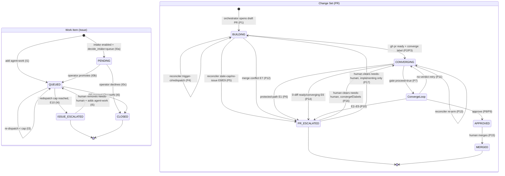
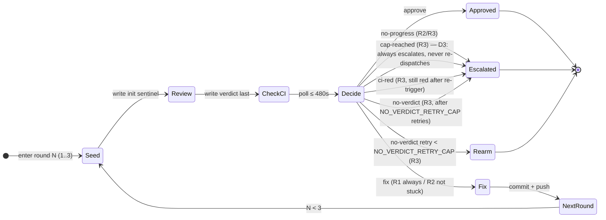

# SPEC.md — Forge-Agnostic Agent-Orchestration Engine Specification

> **Ground truth.** Every engine claim is derived from `mirror/scripts/**`,
> `mirror/.github/workflows/**`, and `mirror/.agents/custom/**`. The `mirror/ORCHESTRATION.md`
> file was stale and not used.

---

## §1 Overview

The system is a forge-agnostic, harness-agnostic autonomous SWE-agent pipeline. Two
long-lived entities move through it — **Work Items** (issues) and **Change Sets** (pull
requests) — whose state is encoded entirely in forge labels (no separate state store).
Three workflows act on those labels:

| Workflow | Role |
|---|---|
| **Dispatch** | Turns a queued Work Item (or `@claude` comment) into an implementing Change Set |
| **Converge** | A bounded 3-round Review→Fix loop that drives a Change Set to APPROVED or ESCALATED |
| **Reconciler** | Cron-driven (`*/15 * * * *`) orthogonal supervisor; detects and recovers stranded entities |

**Durability model.** Entity lifecycle state (QUEUED, BUILDING, …) is encoded in **forge
labels**. Entity counters (`redispatch_count`, `retry_count`) are stored in the service DB
with atomic increment — the DB is the authoritative counter store. Service-level data (repo
registry, operator accounts, dedup cache) is also DB-resident. A crashed process leaves
every entity in its last-written forge label state; the reconciler recovers it on the next
tick. The converge job persists its in-progress state (current round and last verdict) to
the DB so RC-3 re-arm (P13) can resume at the correct round without restarting from R1.

**Dispatch is fire-and-forget.** `HarnessPort.dispatch` returns immediately; the control
plane never blocks awaiting an agent. `Engine.converge` runs as a bounded job (P7) that
legitimately awaits its own spawned reviewers and fixers within one execution.

---

## §2 Entities & States

### Work Item (Issue)

| State | Label encoding | Meaning |
|---|---|---|
| **PENDING** | `awaiting-promotion` | Held in triage queue; awaiting operator promotion or decline |
| **QUEUED** | `agent-work` | Ready for dispatch |
| **ESCALATED** | `needs-human` (`agent-work` removed) | Human decision required |
| **CLOSED** | (closed by forge merge) | Terminal-success |

> **PENDING visibility note.** PENDING issues carry only `awaiting-promotion`; no core
> machine labels are present. The reconciler's RC-5 channel provides stale-notification
> recovery (§4). If the operator neither promotes nor declines within
> `AWAITING_PROMOTION_NUDGE_S` seconds (§7), RC-5 fires a push notification; it does
> not auto-promote (promotion is always a human action).

### Change Set (PR)

| State | Label / draft encoding | Meaning |
|---|---|---|
| **BUILDING** | draft + `agent:implementing` | Specialists producing work |
| **CONVERGING** | ready (non-draft) + `converge` | Eligible for converge loop |
| **APPROVED** | `agent:ready` (`converge` removed) | 0 blockers + CI green; awaiting human merge |
| **ESCALATED** | `needs-human` | Human decision required |
| **MERGED** | (PR merged) | Terminal-success |
| **EMPTY** | (transient) | 0-diff PR; not a label; detected at converge gate |

Notes: `agent:implementing` is not removed when a PR is marked ready; only converge
labels toggle. A **ready or converging** EMPTY PR (0 diff) always escalates to
`ESCALATED`; the agent should never finish with an empty diff (D4). A **stale draft** with 0
diff (agent crashed before committing) is eligible for reconciler RC-1 re-dispatch only when
`is_draft == true AND agent:converge ∉ labels AND stale` — all discriminators are
forge-observable, not reliant on agent self-reporting.

---

## §3 Transition Tables

### Work Item (Issue)

| # | From | To | Trigger | Guard |
|---|---|---|---|---|
| I0a | (new issue, intake enabled) | PENDING | `Engine.intake` → `queue` | `decide_intake` returns `queue` |
| I0b | PENDING | QUEUED | `OrchestratorService.promote` | operator promotes |
| I0c | PENDING | CLOSED | `OrchestratorService.decline` | operator declines (closes issue) |
| I1 | (new issue) | QUEUED | Human/agent adds `agent-work` | — |
| I2 | QUEUED | BUILDING (new PR) | Dispatch workflow `issues:labeled` | `label.name == 'agent-work'` |
| I3 | QUEUED | QUEUED (re-dispatch) | Reconciler RC-4 | no open PR, not touched <`ISSUE_COOLDOWN_S`, redispatch_count < `ISSUE_REDISPATCH_CAP` |
| I4 | QUEUED | ESCALATED | Reconciler RC-4 | no open PR AND redispatch_count ≥ `ISSUE_REDISPATCH_CAP` |
| I5 | ESCALATED | QUEUED | Human removes `needs-human`, adds `agent-work` | issue re-entry after human decision |
| I6 | QUEUED / BUILDING | CLOSED | Human merges PR | `Closes #N` in PR body |

### Change Set (PR)

| # | From | To | Trigger | Guard |
|---|---|---|---|---|
| P1 | (none) | BUILDING | Orchestrator opens draft PR | draft=true, `Closes #N` |
| P2 | BUILDING | CONVERGING | Agent: `gh pr ready` + `converge` label | typecheck+lint pass |
| P3 | BUILDING | CONVERGING | Reconciler `mark-ready` / `mark-ready-and-converge` | stale draft, RC-1 |
| P4 | BUILDING | BUILDING | Reconciler `redispatch` / `trigger-ci` | stale draft, CI failing or absent |
| P5 | BUILDING | ESCALATED | Reconciler `escalate` / `needs-human` | stale + cap reached or no issue |
| P6 | CONVERGING | ESCALATED | Converge protected-path check | diff touches PROTECTED_PATHS |
| P7 | CONVERGING | CONVERGING (loop) | Converge job | non-draft, has `converge` label, idempotency gate passes |
| P8 | CONVERGING | APPROVED | Converge finalize | `approve` token: 0 blockers + CI green |
| P9 | CONVERGING | APPROVED | Converge finalize (`ci-red` recovery) | CI re-triggered and recovers within CI_WAIT_S |
| P10 | CONVERGING | ESCALATED | Converge finalize | `no-progress` / `cap-reached` / `ci-red` / `no-verdict` after retries |
| P11 | CONVERGING | CONVERGING | Converge finalize (`no-verdict`) | retry_count < `NO_VERDICT_RETRY_CAP` |
| P12 | CONVERGING/BUILDING | ESCALATED | Reconciler RC-2 | `mergeable == CONFLICTING` AND not already `needs-human` |
| P13 | CONVERGING | CONVERGING | Reconciler RC-3 | non-draft `converge` PR with no running workflow and no terminal label |
| P14 | CONVERGING (EMPTY) | ESCALATED | Converge gate | 0-diff PR, ready or converging (D4: empty PRs always escalate) |
| P15 | APPROVED | MERGED | Human merges | terminal label `agent:ready` |
| P16 | ESCALATED (PR) | CONVERGING | Human removes `needs-human` | `converge ∈ labels`; RC-3 re-arms next tick |
| P17 | ESCALATED (PR) | BUILDING | Human removes `needs-human` | `agent:implementing ∈ labels`, no `converge`; RC-1 recovers next tick |

**Idempotency gate** guards every CONVERGING entry: before the loop runs, returns
`proceed=false` when the PR is closed/merged, already labeled `needs-human` or
`agent:ready`, **still a draft (`PR.draft == true`)**, or empty. The draft check prevents
a `pull_request:synchronize` event fired by the implementing agent's own commits from
entering the converge loop against an actively-building PR.

---

## §4 Reconciler — Orthogonal Supervisor

Cron `*/15 * * * *`. Four independent channels that can run concurrently; each is
idempotent and re-entrant.

| Channel | Scopes to | Decision function | Outcomes |
|---|---|---|---|
| **RC-1 Stale implementing recovery** | PRs with `agent:implementing` AND NOT (`converge` ∈ labels OR `needs-human` ∈ labels OR `agent:ready` ∈ labels), last dispatch run >`STALE_DRAFT_THRESHOLD_S` | `decide_stale_action` | `escalate`→P5 · `trigger-ci`→P4 · `mark-ready`→P3 · `mark-ready-and-converge`→P3 · `redispatch`→P4 · `needs-human`→P5 |
| **RC-2 Merge-conflict** | All open PRs | `decide_conflict_action` | `escalate`→P12 · `skip` |
| **RC-3 Converge re-arm** | Non-draft PRs labeled `converge` AND NOT `needs-human` ∈ labels | `decide_rearm_action` | `trigger-ci`/`rearm`→P13 · `skip-*` |
| **RC-4 Orphan-issue** | Open `agent-work` issues | `decide_redispatch_action` | `redispatch`→I3 · `escalate`→I4 · `skip-*` |
| **RC-5 Awaiting-promotion nudge** | Issues with `awaiting-promotion` label, last activity > `AWAITING_PROMOTION_NUDGE_S` | — (constant) | `notify-operator` — push notification to the PWA triage queue; no label change, no auto-promote |

RC-1 priority order (first match wins): redispatch_count ≥ `RECONCILER_STALE_REDISPATCH_CAP` → `escalate`; ci_runs == 0 → `trigger-ci`; has_diff == 0 AND is_draft AND has_issue → `redispatch` (row 2.5a: crash-draft with issue — eligible for re-dispatch); has_diff == 0 AND is_draft AND NOT has_issue → `needs-human` (row 2.5b: crash-draft with no issue); has_diff == 0 AND NOT is_draft → `needs-human` (row 2.5c: non-draft 0-diff always escalates, D4); has_converge → `mark-ready`; failing == 0 → `mark-ready-and-converge`; else → `redispatch`/`needs-human`.

> **B8a fix.** The widened RC-1 scope catches non-draft PRs that carry `agent:implementing`
> but no `converge` or terminal label — a state that occurs when the engine crashes between
> marking a PR ready and adding the `converge` label. Those PRs project to BUILDING (the
> else branch of `derive_pr_state`) and were invisible to the old draft-only RC-1.

---

## §5 Converge Sub-Machine (3-Round Loop)

Triggered on CONVERGING PR entry (P7). Each round: Seed → Review → Check-CI → Decide → Fix.

### Round rules

| Round | Fixer addresses | Fix step? |
|---|---|---|
| R1 | Blockers + suggestions | Yes |
| R2 | Blockers only | Yes |
| R3 | Blockers only — final review | **No** |

Nits are never fixed in-loop; accumulated nits are opened as one follow-up issue at
finalize time.

### Verdict schema

Each converge round produces a `Verdict` (written by the reviewer to `.converge-verdict.json`
on the PR branch, read by the Engine via `ForgePort.get_file_contents`):

```json
{"blockers": <int>, "suggestions": <int>, "nits": ["..."], "blocker_signatures": ["stable-slug"]}
```

**Init sentinel** (seeded before each reviewer run):
```json
{"blockers": 1, "suggestions": 0, "nits": [], "blocker_signatures": ["verdict-file-not-written"]}
```
A reviewer that crashes before overwriting the sentinel leaves a phantom blocker (fail-safe).
The string `"verdict-file-not-written"` is reserved; never use it as a real blocker slug.

> **Reviewer-crash masking (accepted behavior).** If a reviewer crashes and leaves the
> sentinel intact, `resolve_blockers` falls back to the comment footer (rows 2–3). If no
> footer was posted (reviewer hung before commenting), `resolve_blockers` returns
> `"unknown"`. At R1/R2 this produces `fix`; the fixer reads the sentinel and terminates
> immediately (§9.1 converge-fixer.md Step 1). The next reviewer runs from the same
> sentinel. At R3 with `"unknown"` blockers, `decide_round` returns `escalate:no-verdict`,
> which correctly caps retries and escalates. The eventual outcome is human escalation,
> not phantom approval. The `escalate:cap-reached` path can trigger at R3 if the reviewer
> crash persists across all rounds and blockers from a non-sentinel prior round match; this
> masks the root cause (reviewer crash) behind a cap-reached E5 label — acceptable because
> the human reviewer will see the stuck state and can diagnose it. No spec change is
> required; this is intentional design under the crash-only durability model.

`blocker_signatures` must be stable slugs (category:finding-key) that do not include
line numbers. The engine compares consecutive rounds to detect no-progress.

### Decision outcomes

| Token | Condition | Edge |
|---|---|---|
| `approve` | `blockers == 0` AND `ci_green == true` (any round) | → APPROVED (P8) |
| `fix` | R1 (always); R2 (if not stuck) | → Fix phase, next round |
| `escalate:no-progress` | R2/R3: same non-empty signatures two consecutive rounds | → ESCALATED (P10, E2) |
| `escalate:no-verdict` | R3: `blockers == "unknown"` | → retry < NO_VERDICT_RETRY_CAP (P11) else ESCALATED (P10, E3) |
| `escalate:ci-red` | R3: `blockers == 0` but CI not green | → CI re-trigger; recover→APPROVED (P9) or ESCALATED (P10, E4) |
| `escalate:cap-reached` | R3: blockers remain (≥1) | → ESCALATED (P10, E5). Work is never discarded — a stuck converge is a human problem (D3). |

---

## §6 Escalation Taxonomy

| # | Cause | Origin | Condition | Entity |
|---|---|---|---|---|
| E1 | **protected-path** | `Engine.converge` setup | diff touches PROTECTED_PATHS | Change Set |
| E2 | `escalate:no-progress` | `decide_round` | same signatures two consecutive rounds | Change Set |
| E3 | `escalate:no-verdict` | `decide_round` | R3, unknown blockers, after 2 retries | Change Set |
| E4 | `escalate:ci-red` | `decide_round` | blockers clear, CI still red after re-trigger | Change Set |
| E5 | `escalate:cap-reached` | `decide_round` | R3, blockers remain (D3: always escalates — no re-dispatch) | Change Set |
| E6 | **empty-PR** | Converge gate | 0-diff, ready or converging PR (D4: always escalates) | Change Set |
| E7 | **merge-conflict** | Reconciler RC-2 | `CONFLICTING` and not already `needs-human` | Change Set |
| E8 | **stale build-cap** | Reconciler RC-1 | reconciler redispatched ≥ 3 times, CI still failing | Change Set |
| E9 | **stale no-issue** | Reconciler RC-1 | stale draft, CI failing or empty, no closing issue | Change Set |
| E10 | **issue redispatch-cap** | Reconciler RC-4 | `agent-work` issue, no PR, re-dispatched ≥ 3 times | Work Item |
| E11 | **fixer-timeout** | `Engine.converge` | fixer did not complete within `CI_WAIT_S`; harness job cancelled | Change Set |

---

## §7 Constants

Single-source home. All implementation code must import from this table; never hardcode.

| Constant | Value | Notes |
|---|---|---|
| `CONVERGE_ROUNDS` | `3` | R3 is final; no fix step |
| `MAX_REDISPATCHES` | `2` | Converge re-dispatch cap. **Was duplicated in 3 places in the reference impl; now single-sourced.** D3 removes the re-dispatch branch from `decide_cap_action`; cap-reached now always escalates. `MAX_REDISPATCHES` is retained for historical reference and `decide_cap_action` tests; do not hardcode `2`. |
| `RECONCILER_STALE_REDISPATCH_CAP` | `3` | RC-1 stale-PR escalate threshold |
| `ISSUE_REDISPATCH_CAP` | `3` | RC-4 orphan-issue escalate threshold |
| `STALE_DRAFT_THRESHOLD_S` | `1200` | 20 min; RC-1 trigger |
| `REARM_RECENT_GUARD_S` | `300` | 5 min; RC-3 skip-recent guard (strict `<`) |
| `ISSUE_COOLDOWN_S` | `900` | 15 min; RC-4 skip-recent guard (strict `<`) |
| `CI_WAIT_S` | `480` | 8 min; per-round CI poll timeout |
| `NO_VERDICT_RETRY_CAP` | `2` | Converge no-verdict retry cap |
| `RECONCILER_CRON` | `"*/15 * * * *"` | Reconciler cadence |
| `PARALLEL_SPECIALIST_CAP` | `4` | Max concurrent specialist agents per converge round |
| `AT_RISK_THRESHOLD` | `5` | `in_flight >= 5` → AT_RISK verdict |
| `AWAITING_PROMOTION_NUDGE_S` | `86400` | 24 h; RC-5 fires push notification if issue sits in PENDING longer than this; does not auto-promote |

### Labels

| Constant | Value |
|---|---|
| `LABEL_AGENT_WORK` | `"agent-work"` |
| `LABEL_NEEDS_HUMAN` | `"needs-human"` |
| `LABEL_IMPLEMENTING` | `"agent:implementing"` |
| `LABEL_CONVERGE` | `"converge"` |
| `LABEL_READY` | `"agent:ready"` |
| `LABEL_TRIAGE` | `"triage"` |
| `LABEL_AWAITING_PROMOTION` | `"awaiting-promotion"` |

> **Note on counter state.** Discrete entity states (QUEUED, BUILDING, …) are fully
> encoded in these labels. Counter values (`redispatch_count`, `retry_count`) are stored in
> the service DB with atomic increment/read (`CounterStore`). Marker comments (§8.2a) are
> posted alongside each counter-incrementing action as a human-visible audit trail, but the
> DB is the authoritative counter store — not the comment count. Converge round state
> (`ConvergeState`) is also persisted to the DB for RC-3 crash recovery.

### PROTECTED_PATHS

```
# from SPEC.md §7 Constants — keep in sync in agents/*.md
PROTECTED_PATHS = [
  ".github/workflows/**",   # CI workflow definitions
  "ARCHITECTURE.md",         # system architecture
  "SECURITY.md",             # threat model (formerly THREAT_MODEL.md)
  "COMPLIANCE.md",           # compliance requirements (doc not yet authored)
  ".agents/**",              # specialist pack dir
  "agents/**",               # orchestration-agent contracts
]
```

### Path-matching semantics

All glob patterns in `PROTECTED_PATHS` and `SPECIALIST_ROUTING` use **gitignore/`pathspec`
semantics**:

- `**` matches zero or more path segments (crosses directory boundaries).
- `*` matches within a single segment only (does not cross `/`).
- Patterns are matched against **repo-root-relative POSIX paths** (e.g.
  `".github/workflows/ci.yml"`, `"src/api/routes.py"`).
- **Bare filenames without path separators** (e.g. `"ARCHITECTURE.md"`, `"SECURITY.md"`)
  match only at the repo root — they are not basename-matched at arbitrary depth.

Implementations must use a `pathspec`-compatible library (Python: `pathspec`; Rust: `globset`
with `require_literal_separator = true` for `*`). Match the full repo-root-relative path
string; do not split or normalise beyond POSIX `/` separators.

> **Security note (B1 / I2 / I8).** Ambiguous match semantics can cause a
> `PROTECTED_PATHS` PR to bypass the E1 gate. The semantics above are binding; any
> implementation divergence is a security blocker.

### Specialist pack constants

| Constant | Value |
|---|---|
| `CONVERGE_REVIEW_BASE` | `["engineering-security-engineer.md", "engineering-code-reviewer.md"]` |
| `SPECIALIST_ROUTING` | See §8.12 |
| `AgentPackConfig.repo_url` default | `"https://github.com/msitarzewski/agency-agents"` |
| `AgentPackConfig.pinned_ref` default | `"d6553e261e595c651064f899a6c33dd5aa71c9e3"` |
| `AgentPackConfig.dest_dir` default | `".agents"` |

### `RunState` / `RunConclusion`

Used by `HarnessPort.get_run_status` (§9.2) and consumed by `decide_rearm_action` (§8.6).

```
RunState    ∈ { "queued", "in_progress", "completed" }
RunConclusion ∈ { "success", "failure", "cancelled" }  # present only when state=="completed"
RunStatus   = { state: RunState, conclusion: RunConclusion | None }
```

### `BLOCKING_CI_CHECKS`

The ordered list of CI check names that must all be green before a converge `approve`
(P8, P9). All 6 are re-polled on the `ci-red` recovery path (see §10.2 step 4g).

| # | Name | Blocker signature slug |
|---|---|---|
| 1 | Type Check | `ci-fail:type-check` |
| 2 | Lint | `ci-fail:lint` |
| 3 | Integration Tests | `ci-fail:integration-tests` |
| 4 | Docker Build & Scan | `ci-fail:docker-build` |
| 5 | Helm Lint | `ci-fail:helm-lint` |
| 6 | Helm Kubeconform | `ci-fail:helm-kubeconform` |

A check is green when its state is `success`, `skipped`, or `neutral`.

---

## §8 Decision Functions

All decision functions are **pure and synchronous** unless noted. No network, no file I/O,
no side effects. They must never be made async.

Exceptions: `resolve_blockers` and `pipeline_health` are impure (they call `ForgePort`
methods). `derive_redispatch_count` and `derive_retry_count` are replaced by DB counter
reads (see §8.2a). In tests, the fake `ForgePort` and `CounterStore` are injected.

**Type validation** is enforced by function signatures. Truth tables document decision
logic only; callers receive a `TypeError` (Python) or compile error (Rust) for wrong-typed
arguments. The "usage error, exit 2" convention of the bash reference implementation is
retired.

Priority tables are evaluated top-to-bottom; first match fires.

### §8.1 `route_entry`

Maps a forge event name to entry parameters.

**Inputs**: `event: string`
**Outputs**: `{model, max_turns, contract}`

| # | Condition | `model` | `max_turns` |
|---|---|---|---|
| 1 | `event == "issues"` | `claude-opus-4-8` | `40` |
| 2 | `event ∈ {issue_comment, pull_request_review_comment}` | `claude-sonnet-4-6` | `30` |
| 3 | else (unknown / empty) | `claude-sonnet-4-6` | `30` |

`contract` = `orchestrator-contract.md` (constant across all branches). Exit 0 for all
inputs including unknown/empty.

### §8.2 `resolve_blockers`

Resolves the effective blocker count for one converge round, falling back from the
verdict JSON to the reviewer's comment footer when the sentinel survived.

**Inputs**: `pr_ref`, `round: int`, `round_started: datetime | None`
**Output**: `int | Literal["unknown"]`

The Engine reads the verdict via `ForgePort.get_file_contents(pr_ref, ".converge-verdict.json")`.
A verdict is sentinel iff `blocker_signatures` contains `"verdict-file-not-written"`.

| # | Condition | Output |
|---|---|---|
| 1 | file present and not sentinel | `.blockers` from JSON, or `"unknown"` if missing/non-numeric |
| 2 | sentinel or file absent; `round_started` is not None | pick most-recent comment footer posted after `round_started` |
| 3 | sentinel or file absent; `round_started` is None | pick most-recent comment footer regardless of age |
| 4 | no footer resolved | `"unknown"` |

`parse_comment_blockers` extracts `🔴 <N> blockers` via regex. The in-round filter
(`comment.created_at >= round_started`) scopes the search to the current round when
provided, preventing stale footers from prior rounds from bleeding through.

### §8.2a `CounterStore` — counter reads and increments

Counters are stored in the service DB with atomic increment. The `CounterStore` port
provides the interface:

```
async get_count(entity_ref, channel: str) -> int
async increment(entity_ref, channel: str) -> int   # returns new value; atomic
async reset(entity_ref, channel: str) -> void
```

| `channel` | Entity | Cap constant | Consumed by |
|---|---|---|---|
| `"stale-pr"` | PR | `RECONCILER_STALE_REDISPATCH_CAP` | `decide_stale_action` |
| `"orphan"` | issue | `ISSUE_REDISPATCH_CAP` | `decide_redispatch_action` |
| `"converge-retry"` | PR | `NO_VERDICT_RETRY_CAP` | converge no-verdict retry |

> **D3 note.** The former `"converge"` issue channel (cap `MAX_REDISPATCHES`, consumer `decide_cap_action`) was removed when D3 simplified `decide_cap_action` to always escalate. No Engine method increments it; `MAX_REDISPATCHES` is retained as a named constant for tests only.

Each Engine action that increments a counter also posts a human-visible action comment on
the forge entity (for audit trail). The comment body includes a namespaced marker for
human readability, but the **DB counter is authoritative** — not the comment count:

| Channel | Marker (audit trail only) |
|---|---|
| `"stale-pr"` | `<!-- orchestrator:redispatch ch=stale-pr -->` |
| `"orphan"` | `<!-- orchestrator:redispatch ch=orphan -->` |
| `"converge-retry"` | `<!-- orchestrator:converge-retry -->` |

The `CounterStore` is injected into the `Engine` alongside the three port interfaces; the
fake `CounterStore` is used in all unit and integration tests.

### §8.3 `decide_round`

Decides the convergence action for one round.

**Inputs**: `round: Literal[1, 2, 3]`, `blockers: int | Literal["unknown"]`,
`ci_green: bool`, `prev_sigs: list[str]`, `curr_sigs: list[str]`

`round` is typed as `Literal[1, 2, 3]`; a value outside this set is a `TypeError` (Python)
or compile error (Rust). Implementations must not accept arbitrary integers.

Sentinel normalization: any list equal to `["verdict-file-not-written"]` → `[]`.

**`blocker_signatures` sort requirement.** Before comparing `curr_sigs == prev_sigs` (row 3
no-progress check), both lists must be sorted lexicographically. The reviewer contract
(`agents/converge-reviewer.md`) is also required to write signatures in lexicographic order,
but the Engine must not rely on the reviewer's ordering — always sort both lists before
comparing. This ensures no-progress detection is stable regardless of reviewer output order.

| # | Condition | Output |
|---|---|---|
| 1 | `blockers == 0 and ci_green` | `approve` |
| 2 | `round == 1` | `fix` |
| 3 | `curr_sigs == prev_sigs and curr_sigs != [] and blockers not in (0, "unknown")` | `escalate:no-progress` |
| 4 | `round == 2` | `fix` |
| 5 | `round == 3 and blockers == "unknown"` | `escalate:no-verdict` |
| 6 | `round == 3 and blockers == 0` (ci not green, else row 1) | `escalate:ci-red` |
| 7 | `round == 3` else (blockers ≥ 1) | `escalate:cap-reached` |

Key edges:
- `"unknown"` never produces `approve`.
- Empty `prev==curr==[]` is NOT no-progress (row 3 requires non-empty `curr_sigs`).
- Row 3 fires before rows 5–7 in R3.
- **R1/R2 with `blockers == "unknown"`** falls through to row 2 or row 4 → `fix`. The
  fixer is dispatched so a reviewer can try again next round; the unknown verdict is not
  treated as a blocker count of 0 (row 1 requires an integer 0).

### §8.4 `decide_cap_action`

When converge cap is reached with blockers, returns the escalation action.

**Inputs**: `redispatch_count: int`, `has_issue: bool`

> **D3 simplification.** A stuck converge is a human problem; work is never discarded by
> re-dispatching from a converging PR. The `redispatch` branch is removed. The function
> always returns `escalate`. `MAX_REDISPATCHES` is retained as a named constant for tests
> and reference; never hardcode `2`.

| # | Condition | Output |
|---|---|---|
| 1 | always | `escalate` |

### §8.5 `decide_stale_action`

Decides recovery action for a stale PR carrying `agent:implementing` (draft or non-draft;
see widened RC-1 scope in §4).

**Inputs**: `redispatch_count: int`, `ci_runs: int`, `has_converge: bool`,
`failing_count: int`, `has_issue: bool`, `has_diff: bool`, `is_draft: bool`

| # | Condition | Output |
|---|---|---|
| 1 | `redispatch_count >= RECONCILER_STALE_REDISPATCH_CAP` | `escalate` |
| 2 | `ci_runs == 0` | `trigger-ci` |
| 2.5a | `not has_diff AND is_draft AND has_issue` | `redispatch` |
| 2.5b | `not has_diff AND is_draft AND not has_issue` | `needs-human` |
| 2.5c | `not has_diff AND not is_draft` | `needs-human` |
| 3 | `has_converge` | `mark-ready` |
| 4 | `failing_count == 0` | `mark-ready-and-converge` |
| 5 | `has_issue` | `redispatch` |
| 6 | else (failing, no issue) | `needs-human` |

Row 2.5 key (D4): the `is_draft` discriminator separates crash-recovery (agent died before
committing anything — draft, 0-diff, eligible for re-dispatch bounded by
`RECONCILER_STALE_REDISPATCH_CAP`) from agent-finished-empty (non-draft, 0-diff — always
escalates; a finished agent must never produce an empty diff). Rows 1 and 2 win over all
2.5 variants. RC-1 will only see non-draft 0-diff PRs if the converge gate itself crashed
before setting `needs-human`; rows 2.5c correctly escalates that edge.

### §8.6 `decide_rearm_action`

For a non-draft converge PR, decides whether to trigger CI, re-arm, or skip.

**Inputs**: `ci_runs: int`, `run: RunStatus | None`, `has_terminal_label: bool`,
`seconds_since_last_run: int | None`, `has_needs_human: bool`

`run` is the result of `HarnessPort.get_run_status` for the most recent converge run on
this PR, or `None` if no run exists (see §9.2 for `RunStatus` type).

`has_needs_human` is `True` when `needs-human ∈ labels`. RC-3 scopes out `needs-human`
PRs before calling this function (see §4), but the input is explicit so the pure function
remains correctly callable in isolation.

| # | Condition | Output |
|---|---|---|
| 0 | `has_needs_human` | `skip-escalated` |
| 1 | `ci_runs == 0` | `trigger-ci` |
| 2 | `run is not None and run.state in ("queued", "in_progress")` | `skip-in-progress` |
| 3 | `run is not None and run.state == "completed" and run.conclusion == "success" and has_terminal_label` | `skip-done` |
| 4 | `seconds_since_last_run is not None and seconds_since_last_run < REARM_RECENT_GUARD_S` | `skip-recent` |
| 5 | else | `rearm` |

Row 0 short-circuits for ESCALATED converge PRs (belt-and-suspenders, since RC-3 scope
excludes them). Row 2 folds `queued` and `in_progress` to prevent duplicate dispatch.
Exactly `REARM_RECENT_GUARD_S` seconds = NOT recent. `None` seconds skips the recency
guard. Any `completed` run with non-`success` conclusion falls through to `rearm`.

**`seconds_since_last_run` derivation (caller responsibility).** The RC-3 channel computes
this value before calling `decide_rearm_action`. When `run` is not `None`, use
`now() - run.started_at` (in seconds). When `run is None AND ci_runs == 0`, pass `None`
(no runs at all → row 1 fires; the recency guard is irrelevant). When `run is None AND
ci_runs > 0` (CI has runs but no converge harness run), use
`now() - forge.last_workflow_run_at(pr, workflow_name)` if that timestamp is available,
otherwise pass `None` so the recency guard is skipped and the function proceeds to `rearm`.

### §8.7 `decide_conflict_action`

**Inputs**: `mergeable: str`, `already_needs_human: bool`

| # | Condition | Output |
|---|---|---|
| 1 | `mergeable == "CONFLICTING" and not already_needs_human` | `escalate` |
| 2 | else | `skip` |

Only exact string `"CONFLICTING"` triggers escalation.

### §8.8 `decide_redispatch_action`

For an `agent-work` issue with no open PR.

**Inputs**: `has_open_pr: bool`, `seconds_since_last_activity: int | None`,
`redispatch_count: int`

| # | Condition | Output |
|---|---|---|
| 1 | `has_open_pr` | `skip-has-pr` |
| 2 | `seconds_since_last_activity is not None and seconds_since_last_activity < ISSUE_COOLDOWN_S` | `skip-recent` |
| 3 | `redispatch_count >= ISSUE_REDISPATCH_CAP` | `escalate` |
| 4 | else | `redispatch` |

Exactly `ISSUE_COOLDOWN_S` seconds = NOT recent. `None` (never touched) skips recency guard.

### §8.9 `pipeline_health`

Reports pipeline health for a repo. Impure — calls `ForgePort.list_prs`.

**Inputs**: `repo: RepoRef`
**Output**: `HealthReport` — fields: `implementing`, `converge`, `ready`, `needs_human`,
`stale_drafts`, `in_flight`, `report_md`, `verdict`

Counts: `implementing` = PRs with `agent:implementing`; `converge` = PRs with `converge`;
`ready` = PRs with `agent:ready`; `needs_human` = PRs with `needs-human`;
`stale_drafts` = draft PRs with `agent:implementing`;
`in_flight` = count of **distinct PRs** in the union `{PRs with agent:implementing} ∪ {PRs with converge}`.
Do not sum `implementing + converge` — PRs that carry both labels (CONVERGING PRs also retain
`agent:implementing`) would be double-counted, causing `AT_RISK` to fire at ~half the real PR count.

| # | Condition | verdict |
|---|---|---|
| 1 | `needs_human > 0` | `BLOCKED` |
| 2 | `in_flight >= AT_RISK_THRESHOLD` | `AT_RISK` |
| 3 | else | `ON_TRACK` |

`BLOCKED` wins over `AT_RISK` when both conditions hold.

### §8.10 `derive_issue_state` / `derive_pr_state`

Pure label→state projection functions. Synchronous. No I/O.

`derive_issue_state(labels, closed)` → `IssueState`:
- `closed == true` → `CLOSED` (beats all labels)
- `needs-human ∈ labels` → `ESCALATED`
- else → `QUEUED`

`derive_pr_state(labels, draft, merged, changed_files)` → `PRState ∈ {MERGED, ESCALATED, APPROVED, EMPTY, CONVERGING, BUILDING}`:
- `merged == true` → `MERGED` (beats all labels)
- `needs-human ∈ labels` → `ESCALATED`
- `agent:ready ∈ labels` → `APPROVED`
- `changed_files == 0 AND NOT draft` → `EMPTY` (evaluated before CONVERGING to catch
  ready/converging PRs with 0 diff; the converge gate escalates these — §10.2 step 3)
- `converge ∈ labels AND NOT draft` → `CONVERGING`
- else → `BUILDING` (draft, or no state labels)

`EMPTY` is a derived-only state — it has no label encoding. A draft PR with `changed_files==0`
derives to `BUILDING` (the crash-recovery case; RC-1 handles it via `decide_stale_action`
rows 2.5a/b). `PRState` must be defined as an enum that includes `EMPTY`.

**`PR.changed_files` and `get_changed_files` equivalence.** `PR.changed_files` (the integer
in `get_pr`/`list_prs` responses) and `len(forge.get_changed_files(pr))` (the live path list)
must return the same value for the same PR at the same HEAD commit. `derive_pr_state` uses
the integer field; `Engine.converge` step 3 uses the list length. Implementations must ensure
these are derived from the same source. The forge adapter must not return a cached integer
count that could diverge from the live file list. If the forge API can return these
inconsistently (e.g., due to caching), the adapter must resolve the inconsistency before
surfacing either value to the Engine.

### §8.11 `decide_intake`

| `allowlist` | `author in allowlist` | Result |
|---|---|---|
| empty (`[]`) | n/a | `admit` — gate disabled |
| non-empty | true | `admit` |
| non-empty | false | `queue` |

Pure, synchronous, no forge calls. Exact string equality (no case folding, no fuzzy match).
Side effects (label writes) are performed by `Engine.intake`, not this function.

### §8.12 `decide_specialists`

```
decide_specialists(changed_paths: list<string>, round: int) -> list<AgentRef>
```

Pure synchronous. Returns 2–4 `AgentRef` values. **Always returns at least the base set.**

**Algorithm (deterministic):**
```
base   = list(CONVERGE_REVIEW_BASE)              # always included; insertion-ordered
extras = []                                       # routing additions, in SPECIALIST_ROUTING order
for entry in SPECIALIST_ROUTING:                  # iterate in definition order — not a set
    if any(path matches entry.pattern for path in changed_paths):
        for ref in entry.agent_refs:
            if ref not in base and ref not in extras:
                extras.append(ref)
# Cap: base set always retained; extras truncated to fill remaining slots
cap    = PARALLEL_SPECIALIST_CAP
assert len(base) <= cap, "CONVERGE_REVIEW_BASE exceeds PARALLEL_SPECIALIST_CAP"
result = base + extras[:cap - len(base)]
return result
```

`round` is passed but currently unused; reserved for future per-round suppression.

> **F1/F2 fix.** The previous description said "deduplicate against base set" (set-based,
> non-deterministic insertion order). This algorithm is deterministic: `SPECIALIST_ROUTING`
> is iterated in definition order; extras are capped to `cap - len(base)` so the base set
> is **always** fully retained regardless of `PARALLEL_SPECIALIST_CAP` value.

**`SPECIALIST_ROUTING`:**

| Glob pattern(s) | AgentRef |
|---|---|
| `**/migrations/**`, `**/*.sql`, `**/schema*` | `engineering-database-optimizer.md` |
| `**/*.tsx`, `**/*.css`, `**/components/**`, `**/ui/**` | `testing-accessibility-auditor.md` |
| `**/api/**`, `**/routes/**`, `**/handlers/**` | `testing-api-tester.md` |

Security (`engineering-security-engineer.md`) is always in the base set and is also the
default for auth/session/crypto patterns (already included via base).

**Invariant (I9):** `AgentRef` values come only from this function's output; contributor
text is never interpolated into an `AgentRef` string.

---

## §9 Ports

All port methods are **async** (they perform I/O).

### §9.1 ForgePort

**Return types:**

```
Issue {
  ref:    IssueRef
  title:  string
  body:   string
  labels: list[string]
  closed: bool
  author: string
}

PR {
  ref:           PRRef
  title:         string
  body:          string
  head_branch:   string
  draft:         bool
  merged:        bool
  labels:        list[string]
  changed_files: int        # 0 for a PR with no committed diff
  state:         "open" | "closed"
}
```

`PR.changed_files` is the total number of files changed on the PR's branch relative to
its base. This is the count used by `derive_pr_state` and `decide_stale_action`. It is
always present in `get_pr` and `list_prs` responses; implementations must not require a
separate `get_changed_files` call to obtain it.

**Methods:**

```
async get_issue(issue_ref) -> Issue
async list_issues(repo, labels) -> list<Issue>
async add_label(entity_ref, label: string) -> void
async remove_label(entity_ref, label: string) -> void
async set_labels(entity_ref, labels: list[string]) -> void   # atomic replace-set (PUT semantics)
async create_pr(repo, title, body, head, base, draft) -> PRRef
async get_pr(pr_ref) -> PR
async list_prs(repo, state, labels) -> list<PR>
async set_pr_ready(pr_ref) -> void
async get_changed_files(pr_ref) -> list<string>
async get_check_runs(pr_ref) -> list<CheckRun>
async get_mergeable(pr_ref) -> string        # "MERGEABLE" | "CONFLICTING" | "UNKNOWN"
async get_closing_issue(pr_ref) -> IssueRef | None
async list_comments(entity_ref, since: datetime | None = None) -> list<Comment>
async post_comment(entity_ref, body: string) -> void
async create_review(pr_ref, event, body) -> void
async create_issue(repo, title, body) -> IssueRef
async get_file_contents(pr_ref, path: string) -> bytes | None
async put_file_on_branch(pr_ref, path: string, content: bytes, commit_message: string) -> void
async copy_file_on_branch(pr_ref, src_path: string, dest_path: string) -> void
async last_workflow_run_at(pr_ref, workflow_name) -> datetime | null
async last_dispatch_run_at(pr_ref) -> datetime | null
```

`list_comments` returns comments in chronological order. When `since` is provided, only
comments created at or after that timestamp are returned. Implementations must paginate
transparently — callers always receive the full result.

`get_file_contents` fetches a file at `path` from the HEAD of the PR's branch; returns
`None` when the file does not exist. Used by `resolve_blockers` to read `.converge-verdict.json`.

`put_file_on_branch(pr_ref, path, content, commit_message)` writes arbitrary bytes to
`path` on the PR's HEAD branch in a single atomic commit. Used by `Engine.converge` step
4b to seed the init sentinel before each reviewer dispatch. Creates the file if absent,
overwrites if present. `path` is a repo-root-relative POSIX path.

`copy_file_on_branch(pr_ref, src_path, dest_path)` copies the file at `src_path` to
`dest_path` on the PR's HEAD branch in a single commit (e.g., via the forge Contents API
or a git command on the server-side clone). Used by `Engine.converge` step 4b to archive
the live verdict file as `.converge-verdict-rN.json` (B3 verdict history). `src_path` and
`dest_path` are repo-root-relative POSIX paths. Raises if `src_path` does not exist.

`get_closing_issue(pr_ref) -> IssueRef | None` parses the PR body for a `Closes #N` /
`Fixes #N` / `Resolves #N` reference (case-insensitive, any of these three keywords) and
returns the corresponding `IssueRef` in the same repo, or `None` if no such reference is
present. **`has_issue`** is `True` iff `get_closing_issue(pr_ref)` returns a non-`None`
value; **`issue_ref`** is that return value. The Engine calls `get_closing_issue` early in
`Engine.converge` (step 2a) so all downstream branches can use `has_issue`/`issue_ref`
without re-fetching.

`set_labels(entity_ref, labels)` atomically replaces the entity's full label set with
`labels` (equivalent to GitHub's `PUT /issues/:number/labels`). Use for the
`LABEL_AWAITING_PROMOTION → LABEL_AGENT_WORK` swap in `promote` to prevent the
`LABEL_AWAITING_PROMOTION + LABEL_AGENT_WORK` coexistence window (invariant I7).
`last_dispatch_run_at(pr_ref)` returns the start-time of the most recent harness dispatch
run for this PR's branch. Used by RC-1 to detect stale implementing PRs; "stale" means
`now - last_dispatch_run_at(pr) >= STALE_DRAFT_THRESHOLD_S`.

**`CheckRun` type** (returned by `get_check_runs`):

```
CheckRun {
  name:       string        # check name matching BLOCKING_CI_CHECKS entries
  state:      RunState      # see §7 RunState
  conclusion: RunConclusion | None   # non-None when state == "completed"
}
```

A check is green when `state == "completed"` AND `conclusion ∈ {"success", "skipped",
"neutral"}`. A check is red when `state == "completed"` AND `conclusion` is any other value.
A check that has never run is absent from the list; the Engine treats an absent check as red
(conservative: not yet green).

`last_dispatch_run_at(pr_ref)` returns harness-world data (when the most recent
`HarnessPort.dispatch` run started for this PR's branch). It is placed on `ForgePort`
because the concrete GitHub adapter reads this via the GitHub Actions Workflow Runs API —
a forge-native endpoint. The placement is intentional; do not move it to `HarnessPort`
without a human decision.

`RunHandle` is a value type serialisable to/from a stable string `run_id`. The serialisation
round-trip must be lossless: `RunHandle.from_run_id(h.run_id) == h`. `run_id` is the form
stored in the DB and passed to `SessionPort` methods.

### §9.2 HarnessPort

```
async dispatch(context: DispatchContext) -> RunHandle
```

Single-shot: returns immediately; engine never blocks awaiting the agent.

```
async trigger_workflow(name: string, ref, inputs: dict) -> void
async trigger_ci(pr_ref) -> void
async get_run_status(handle: RunHandle) -> RunStatus
async cancel(handle: RunHandle) -> void
```

`cancel(handle)` requests termination of a running harness job. Idempotent: calling
`cancel` on an already-terminal run is a no-op (no error raised). The Engine calls
`cancel` whenever a poll loop exits due to `CI_WAIT_S` timeout, for both reviewer and
fixer handles, to prevent a timed-out agent from completing later and overwriting the
next round's init sentinel or verdict file. The harness adapter's actual cancellation
semantics (graceful signal vs hard kill) are implementation-defined; the Engine treats
the post-cancel state as "no longer in-flight" and proceeds immediately.

`RunStatus = { state: RunState, conclusion: RunConclusion | None }` (see §7 for enum values).

**`DispatchContext` schema (sealed — all fields enumerated):**

```
DispatchContext {
  # Entity context (one of the following)
  issue_ref:   IssueRef | None
  pr_ref:      PRRef    | None

  # Agent selection
  contract:    string          # path to orchestration-agent contract file (agents/*.md)

  # Run parameters
  model:       string          # from route_entry
  max_turns:   int             # from route_entry

  # Credential scope (D1 / I3)
  # The harness injects an ephemeral forge token whose scope depends on the agent type:
  #   "repo-comment" — triager only; may read the repo and post comments; CANNOT add
  #                    labels, create/close PRs, trigger workflows, or write code. This
  #                    is the narrowest scope the forge platform supports for write access.
  #   "repo-branch"  — implementer, orchestrator, reviewer, fixer; may read/write the
  #                    agent's own branch and PR (gh pr ready, add_label, create_pr, etc.).
  #
  # The orchestrator's FORGE_TOKEN, HARNESS_API_KEY, and operator-level credentials are
  # NEVER injected. PortProvider holds those and never surfaces them here.
  #
  # SEALED SCHEMA: no field outside this list may be added to DispatchContext. Any field
  # not listed here MUST NOT be passed to harness.dispatch. The harness adapter MUST
  # reject DispatchContext objects containing unrecognized fields. This is the mechanical
  # enforcement of I3 — a field-name check alone is insufficient; schema sealing prevents
  # credential leakage under any field name.
  forge_token_scope: "repo-comment" | "repo-branch"   # literal; harness reads this to issue the correct token

  # Specialist spawn allow-set (D2 / I9)
  # Set by the Engine before dispatching any reviewer or fixer. The harness MUST
  # reject any sub-agent spawn whose AgentRef is not in this list.
  #
  # Semantics of None:
  #   None  → no harness-level allow-set restriction. The harness MUST NOT reject
  #            sub-agent spawns solely because allowed_agent_refs is absent.
  #            Contract-level I9 enforcement applies instead (agent contract forbids
  #            constructing AgentRef from contributor-supplied text).
  #            Used for implementer and orchestrator dispatches where the implementer
  #            may spawn specialist sub-agents from the pack (see agents/implementer.md §2).
  #   list  → harness MUST reject any spawn whose AgentRef is not in this list.
  #            Used for converge reviewer/fixer dispatches (D2).
  #
  # The two cases address different threat models:
  #   - Converge: the diff is contributor-controlled content that could inject
  #     adversarial AgentRef strings to steer specialist selection; harness-level
  #     enforcement is required.
  #   - Implementer/orchestrator: AgentRef selection is from a hardcoded routing
  #     table in the contract; contract-level I9 ("never construct from contributor
  #     text") is sufficient.
  allowed_agent_refs: list[AgentRef] | None
}
```

**Triager dispatch:** use `forge_token_scope: "repo-comment"` (narrowest write scope).
**All other dispatches:** use `forge_token_scope: "repo-branch"`.

**Allowlist injection for the triager.** The triager contract requires the configured
allowlist to report admit/queue status in its structured comment. The harness injects the
allowlist via an `ALLOWLIST` environment variable in the sandbox (comma-separated
usernames). `DispatchContext` does not carry the allowlist directly (it would be visible
to the agent as a prompt field and could be confused with an instruction); the harness
reads it from `RepoConfig` at dispatch time and sets `ALLOWLIST` in the sandbox
environment alongside the forge token.

> **Security note (I3 / D1).** The sandbox credential is an ephemeral, repo-scoped token
> sufficient for the agent to read/write its own branch and PR — the minimum needed for
> `gh pr ready`, `create_pr`, `add_label`, and similar operations. It does NOT include the
> orchestrator's service `FORGE_TOKEN`, `HARNESS_API_KEY`, or any multi-repo operator
> credentials. The `PortProvider` holds those and never surfaces them via `DispatchContext`.

> **Security note (I9 / D2).** The Engine computes `allowed_agent_refs =
> decide_specialists(changed_paths, round)` and sets it in `DispatchContext` before
> dispatching the reviewer. The harness adapter **must** enforce this list: any sub-agent
> spawn by the reviewer or fixer with an `AgentRef` not in `allowed_agent_refs` must be
> rejected with an error, not silently allowed. This mechanises I9 for converge dispatches —
> contributor-injected text in the diff cannot steer the spawn even if the reviewer LLM is
> deceived. When `allowed_agent_refs` is `None` (implementer/orchestrator dispatches),
> harness-level enforcement is disabled; I9 is enforced via agent contract discipline.

Specialists are spawned by orchestration agents (reviewer/fixer) via `dispatch`, using the
`allowed_agent_refs` gate. `AgentRef` values come only from `decide_specialists` output
(invariant I9).

**Depth-1 rule.** Depth is measured from the dispatching *orchestration agent*, not from
the Engine. An orchestration agent (reviewer, fixer) may spawn fix-specialists
(`subagent_type: "general-purpose"`) — those are depth-1 from the orchestration agent
(depth-2 from the Engine). Fix-specialists must not spawn further sub-agents — they are
the leaf level. An orchestration agent must never spawn another orchestration agent.
Implementer/orchestrator dispatches are depth-0 from the Engine; they may spawn pack
specialists at depth-1 from themselves.

**`SpawnDenied` error.** When the harness rejects an out-of-allow-set spawn attempt, it
raises `SpawnDenied(attempted: AgentRef, allowed: list[AgentRef])`. This error type must
be importable from the harness adapter module. `FakeHarnessPort` exposes a
`simulate_spawn_attempt(agent_ref: AgentRef)` method that raises `SpawnDenied` if
`agent_ref` is not in the current `DispatchContext.allowed_agent_refs` (or never raises
if `allowed_agent_refs` is `None`).

### §9.3 SessionPort

```
async list_runs(repo, since: datetime | None = None, status: str | None = None,
                type: str | None = None) -> list<RunSummary>
async get_run(run_id: str) -> RunDetail
async stream_events(run_id: str) -> AsyncIterator<Event>
async cancel(run_id: str) -> void
async intervene(run_id: str, message: string) -> void
```

`run_id` is the stable string identifier for a run, serialized from a `RunHandle`.
Does not alter forge label state. Cancellation leaves the entity in its last-written
label state; the reconciler recovers it on the next tick.

### §9.4 ConvergeStateStore

Stores per-PR converge loop state. Separate from `CounterStore` because it holds typed
values (integers and datetimes) that counters cannot represent.

```
async get_converge_round(pr_ref) -> int              # returns 0 if unset (before any round completes)
async set_converge_round(pr_ref, round: int) -> void # persists after a round fully completes
async get_round_started(pr_ref) -> datetime | None   # None if no round is currently in progress
async set_round_started(pr_ref, started: datetime) -> void
async clear_converge_state(pr_ref) -> void           # called at finalize (approve or terminal escalate)
```

`get_converge_round` returns `0` when no round has been fully persisted (first call or
after `clear_converge_state`). The converge loop uses `start = get_converge_round() + 1`,
which gives `1` for a fresh PR.

`set_converge_round` is called only when a round reaches a terminal or advancing decision
(approve, fix, or a counted escalation) — **not** when the action is a P11 no-verdict
re-arm, to prevent advancing the round index past R3 before retries are exhausted.

---

## §10 Engine Methods

The `Engine` is stateless per-call. Constructed with
`(ForgePort, HarnessPort, SessionPort, CounterStore, ConvergeStateStore)`. Holds no
durable in-process state other than the arguments passed to each method.

### §10.1 `Engine.dispatch`

Entry from `issues:labeled` (I2, P1) or `@claude` comment (I5).

1. `route_entry(event.name)` → `{model, max_turns, contract}`.
2. For `issues:labeled agent-work`:
   - **Dedup guard:** check `forge.list_prs(repo, state="open", labels=[LABEL_IMPLEMENTING])`
     filtered to PRs whose body contains `Closes #{issue_ref.number}`. If a matching open
     implementing PR exists, skip dispatch (return immediately — idempotent). This prevents
     a duplicate `issues:labeled` event (e.g., webhook replay outside the dedup window) from
     opening a second draft PR for the same issue.
   - `harness.dispatch(DispatchContext(issue_ref, contract=..., forge_token_scope="repo-branch", ...))`.
3. For `@claude` comment → `harness.dispatch(DispatchContext(pr_ref or issue_ref, contract=..., forge_token_scope="repo-branch", ...))`.

Covers I2, P1, I5.

### §10.2 `Engine.converge`

Entry on `pull_request:ready_for_review`, `labeled:converge`, or `synchronize` (P2, P7).

1. **Idempotency gate** — read PR label state; return immediately if:
   - PR is closed or merged
   - PR carries `needs-human` or `agent:ready` (terminal labels)
   - PR is still a draft (`PR.draft == true`) — a `synchronize` event from the implementing
     agent's own commits must not enter the converge loop; the implementer owns draft PRs
2. **Setup** — resolve shared values used throughout:
   - `changed_paths = await forge.get_changed_files(pr)`
   - `issue_ref = await forge.get_closing_issue(pr)` (may be `None`)
   - `has_issue = issue_ref is not None`
2a. **Protected-path check** — `changed_paths` vs `PROTECTED_PATHS`. On match:
   `forge.add_label(pr, LABEL_NEEDS_HUMAN)`;
   `converge_state.clear_converge_state(pr_ref)` → return `ESCALATED` (P6, E1).
   _Note: `clear_converge_state` is called here so that if the PR is later de-escalated
   via P16 (deescalate_pr), the converge loop restarts at R1 rather than a stale round.
   Engine.converge will re-check PROTECTED_PATHS on re-entry and immediately re-escalate
   if the protected-path change is still present._
3. **EMPTY check** — `len(changed_paths) == 0` AND PR is not draft (ready/converging):
   `forge.add_label(pr, LABEL_NEEDS_HUMAN)`;
   `converge_state.clear_converge_state(pr_ref)` → return `ESCALATED` (P14, E6).
   _D4: A finished agent must never produce a 0-diff PR. No re-dispatch; human reviews why._
4. **Converge loop** (rounds 1–`CONVERGE_ROUNDS`). This loop runs inside one converge job
   (P7), legitimately awaiting its own spawned agents and polling CI. The Engine persists
   round state (including `round_started`) to the `ConvergeStateStore` after each
   advancing decision so RC-3 re-arm (P13) can resume at the correct round:
   a. Determine start round: `start = converge_state.get_converge_round(pr_ref) + 1`
      (returns `0` if unset → `start = 1`).
      Initialize `accumulated_nits: list[str] = []` — collects nits across all rounds for
      the finalize-time follow-up issue.
   b. For each round `r` from `start` to `CONVERGE_ROUNDS`:
      - Record `round_started = now()` and persist: `converge_state.set_round_started(pr_ref, round_started)`.
      - Seed init sentinel to `.converge-verdict.json` on the PR branch:
        `forge.put_file_on_branch(pr, ".converge-verdict.json", SENTINEL_BYTES, "chore: init converge sentinel")`
        where `SENTINEL_BYTES` is the JSON-encoded sentinel value (§7 `Verdict`). This is a crash fail-safe.
      - Compute `specialist_refs = decide_specialists(changed_paths, r)`.
      - Build reviewer `DispatchContext` with `allowed_agent_refs = specialist_refs` (I9/D2).
      - **Dispatch reviewer**: `harness.dispatch(reviewer_context)` → `reviewer_handle`.
      - **Await reviewer**: poll `harness.get_run_status(reviewer_handle)` until `completed`
        or `CI_WAIT_S` elapses. On timeout: `await harness.cancel(reviewer_handle)` before
        proceeding — prevents a ghost reviewer from completing later and overwriting the next
        round's init sentinel or verdict file.
      - Poll `forge.get_check_runs(pr)` for CI green/red.
      - `resolve_blockers(pr_ref, r, round_started)` → `int | "unknown"`.
      - Source signature inputs for `decide_round`:
        - `curr_sigs = verdict.blocker_signatures` (from the current `.converge-verdict.json`
          after sentinel normalization per §8.2).
        - `prev_sigs`: if `r > 1`, read `forge.get_file_contents(pr, f".converge-verdict-r{r-1}.json")`
          and parse its `blocker_signatures`; if `r == 1`, `prev_sigs = []`.
        - **P11 retry behavior:** When round `r` is retried (P11 re-arm), `copy_file_on_branch`
          overwrites `.converge-verdict-r{r}.json` with the new attempt's verdict; the prior
          attempt's file is not preserved. `prev_sigs` always reads `.converge-verdict-r{r-1}.json`
          regardless of retry count — the no-progress check compares against the prior-numbered
          round, not a prior attempt of the same round.
      - Append nits from this round: `accumulated_nits.extend(verdict.nits)`.
      - `decide_round(r, blockers, ci_green, prev_sigs, curr_sigs)` → token.
      - **Conditionally persist round** (only for advancing decisions, NOT P11 re-arm):
        if token is NOT `escalate:no-verdict` with `retry_count < NO_VERDICT_RETRY_CAP`:
        `converge_state.set_converge_round(pr_ref, r)`.
      - Copy verdict (for all decisions including P11): `forge.copy_file_on_branch(pr,
        ".converge-verdict.json", f".converge-verdict-r{r}.json")` (B3: permanent per-round
        history file for WEBUI and the next reviewer to diff against).
   c. Act on token:

   > **Escalation write ordering (normative).** For all escalation tokens (`no-progress`,
   > `no-verdict` at cap, `ci-red` fail, `cap-reached`, fixer-timeout): the forge label
   > write (`forge.add_label(pr, LABEL_NEEDS_HUMAN)`) MUST precede the DB mutations
   > (`counter.reset`, `clear_converge_state`). This ordering ensures crash-safety: if the
   > process crashes between the label write and the DB mutations, the reconciler sees
   > `LABEL_NEEDS_HUMAN` and ignores the PR. If the process crashes before the label write,
   > the stale `converge` label causes RC-3 to re-arm — the engine re-enters, re-evaluates,
   > and re-escalates. A stale `ConvergeState` round after a partial escalation (label
   > written, DB not cleared) is recovered by `deescalate_pr`, which calls
   > `clear_converge_state` to reset converge state before P16/P17 recovery begins.

      - `approve` → add `LABEL_READY`, remove `LABEL_CONVERGE`, post approving review;
        `forge.create_issue(repo, "Converge follow-up nits", body)` where `body` is the
        deduplicated text of `accumulated_nits` (deduplicated by exact string equality,
        first-seen order preserved; omit `create_issue` if `accumulated_nits` is empty after
        deduplication);
        `await counter.reset(pr_ref, "converge-retry")`;
        `converge_state.clear_converge_state(pr_ref)` → `APPROVED` (P8).
      - `fix` (R1/R2) → build fixer `DispatchContext` with `allowed_agent_refs = specialist_refs`,
        `forge_token_scope = "repo-branch"`;
        `harness.dispatch(fixer_context)` → `fixer_handle`;
        **Await fixer**: poll `harness.get_run_status(fixer_handle)` until `completed` or
        `CI_WAIT_S` elapses; on timeout: `await harness.cancel(fixer_handle)`;
        `forge.add_label(pr, LABEL_NEEDS_HUMAN)`;
        `await counter.reset(pr_ref, "converge-retry")`;
        `converge_state.clear_converge_state(pr_ref)`; return `ESCALATED` (P10, E11);
        advance to next round.
      - `escalate:no-progress` → `forge.add_label(pr, LABEL_NEEDS_HUMAN)`;
        `await counter.reset(pr_ref, "converge-retry")`;
        `converge_state.clear_converge_state(pr_ref)` → `ESCALATED` (P10, E2).
      - `escalate:no-verdict` → `retry_count = await counter.get_count(pr_ref, "converge-retry")`;
        if `retry_count < NO_VERDICT_RETRY_CAP`: post re-arm comment
        (audit marker: `<!-- orchestrator:converge-retry -->`);
        `await counter.increment(pr_ref, "converge-retry")`; do NOT persist round;
        re-arm (P11) by returning — RC-3 or a direct trigger resumes at the same round;
        else `forge.add_label(pr, LABEL_NEEDS_HUMAN)`;
        `await counter.reset(pr_ref, "converge-retry")`;
        `converge_state.clear_converge_state(pr_ref)` → `ESCALATED` (P10, E3).
      - `escalate:ci-red` → `harness.trigger_ci(pr)`; poll **all `BLOCKING_CI_CHECKS`** up
        to `CI_WAIT_S`; if all green → execute the full **`approve` token actions** (same
        as P8): add `LABEL_READY`, remove `LABEL_CONVERGE`, post approving review, create
        follow-up nit issue if `accumulated_nits` non-empty,
        `await counter.reset(pr_ref, "converge-retry")`,
        `converge_state.clear_converge_state(pr_ref)` → `APPROVED` (P9);
        else `forge.add_label(pr, LABEL_NEEDS_HUMAN)`;
        `await counter.reset(pr_ref, "converge-retry")`;
        `converge_state.clear_converge_state(pr_ref)` → `ESCALATED` (P10, E4).
      - `escalate:cap-reached` → `forge.add_label(pr, LABEL_NEEDS_HUMAN)`;
        `await counter.reset(pr_ref, "converge-retry")`;
        `converge_state.clear_converge_state(pr_ref)` → `ESCALATED`
        (P10, E5). _D3: Work is never discarded. The human decides whether to clear the
        label and continue converging, or close the PR._

### §10.3 `Engine.reconcile`

Runs the four RC channels concurrently; returns `ReconcileReport`.

```
ReconcileReport {
  stale_acted: int, conflicts_flagged: int, rearmed: int, redispatched: int, escalated: int
}
```

**Field-to-channel mapping:**
- `stale_acted` — incremented by RC-1 for every PR on which any action fires
  (trigger-ci, redispatch, mark-ready, mark-ready-and-converge, needs-human, escalate).
- `conflicts_flagged` — incremented by RC-2 for every `escalate` action (already-labeled
  skips do not count).
- `rearmed` — incremented by RC-3 for every `rearm` or `trigger-ci` action.
- `redispatched` — incremented by RC-4 for every `redispatch` action. RC-1 `redispatch`
  actions are counted in `stale_acted`, not `redispatched` (RC-1 and RC-4 are distinct).
- `escalated` — incremented by RC-1 (`escalate` action), RC-2 (`escalate` action), and
  RC-4 (`escalate` action). RC-3 does not escalate. Each escalation from any channel
  increments this field once.

Channels are independent and may run concurrently (they operate on disjoint entity sets).
Within each channel, entities are processed serially to avoid conflicting label writes.

**Counter reads and increments in reconcile channels:**
- **RC-1 (stale implementing recovery):** read `pr_state = derive_pr_state(labels, draft, merged, changed_files)` and `is_draft = pr.draft` before calling `decide_stale_action`. Read `redispatch_count = await counter.get_count(pr_ref, "stale-pr")`. Call `decide_stale_action(redispatch_count, ci_runs, has_converge, failing_count, has_issue, has_diff, is_draft)`. When acting `redispatch`: post action comment (audit marker: `<!-- orchestrator:redispatch ch=stale-pr -->`); `await counter.increment(pr_ref, "stale-pr")`.
- **RC-3 (converge re-arm):** scope already excludes `needs-human` PRs (§4 table); call `decide_rearm_action(ci_runs, run, has_terminal_label, seconds_since_last_run, has_needs_human=False)` — `has_needs_human` is always `False` here because the scope filter guarantees it; the explicit `False` prevents silent regression if the scope filter is ever relaxed.
- **RC-4 (orphan-issue):** `redispatch_count = await counter.get_count(issue_ref, "orphan")` before calling `decide_redispatch_action`. When acting `redispatch`: post `@claude` comment (audit marker: `<!-- orchestrator:redispatch ch=orphan -->`); `await counter.increment(issue_ref, "orphan")`.

### §10.4 `Engine.intake`

Entry on `issues:opened`/`issues:reopened` when `repo.intake_enabled == true`.

1. `decision = decide_intake(event.actor, repo.allowlist)` → `{admit, queue}`.
   Pure, synchronous, no side effects (I4).
2. **Audit log** (I6): write an audit record to the DB:
   `{event: "intake", issue_ref, actor: event.actor, decision, timestamp: now()}`.
   This record is the authoritative trace of every intake decision; the triager comment (step 3)
   is human-visible but the DB record is the audit trail.
3. Dispatch triager agent via `harness.dispatch` (read-only; posts one structured comment
   summarising the triage result).
4. `admit` → `forge.set_labels(issue, [LABEL_TRIAGE, LABEL_AGENT_WORK])` (atomic set; I7) →
   fires `issues:labeled` → I2.
5. `queue` → `forge.set_labels(issue, [LABEL_TRIAGE, LABEL_AWAITING_PROMOTION])` (atomic set; I7)
   → issue appears in PWA triage queue.

> **Step-order note.** `decide_intake` (step 1) runs before the triager dispatch (step 3)
> so the decision is available to write to the audit log synchronously. The triager is
> dispatched after the decision is made and logged; it does not influence `decide_intake`.
>
> **I6 human-promotion audit.** `OrchestratorService.promote` (§11.3) must also write a
> `{event: "promote", issue_ref, operator, timestamp, allowlist_snapshot: list<string>}`
> audit record to the DB when a human promotes an issue from `AWAITING_PROMOTION` to
> `AGENT_WORK`. `allowlist_snapshot` captures the repo's allowlist at promotion time,
> enabling post-hoc confirmation that the promotion was consistent with the configured gate.

---

## §11 Service Contract

### §11.1 Event routing

`handle_event` routes a `ForgeEvent` (evaluated top-to-bottom, first match wins):

| `name` | `action` | condition | Routes to |
|---|---|---|---|
| `issues` | `opened` / `reopened` | `intake_enabled == true` | `Engine.intake` |
| `issues` | `labeled` | `label == LABEL_AGENT_WORK` | `Engine.dispatch` |
| `issue_comment` | any | body contains `@claude` AND (`repo.allowlist` empty OR `event.actor ∈ allowlist`) AND issue carries `LABEL_AGENT_WORK` | `Engine.dispatch` |
| `pull_request_review_comment` | any | body contains `@claude` AND (`repo.allowlist` empty OR `event.actor ∈ allowlist`) AND PR carries `LABEL_IMPLEMENTING` | `Engine.dispatch` |
| `pull_request` | `ready_for_review` | — | `Engine.converge` |
| `pull_request` | `labeled` | `label == LABEL_CONVERGE` | `Engine.converge` |
| `pull_request` | `synchronize` | — | `Engine.converge` |
| cron tick | — | — | `Engine.reconcile` per enabled repo |
| anything else | — | — | no-op |

`synchronize` is safe because `Engine.converge` begins with the idempotency gate, which
returns immediately for draft PRs. A `synchronize` event fired by the implementing agent's
own commits (while the PR is still a draft) is therefore a no-op — it does not enter the
converge loop.

### §11.2 Configuration types

```
SwarmLimits { max_concurrent_runs_global: int, max_concurrent_runs_per_repo: int, max_concurrent_reconciles: int }
# sane defaults: global=10, per_repo=4, reconciles=4

RepoConfig { repo: RepoRef, enabled: bool, intake_enabled: bool = true, allowlist: list<string> }

Config { repos: list<RepoConfig>, limits: SwarmLimits, agent_pack: AgentPackConfig,
         reconcile_cron: string = "*/15 * * * *", dedup_window: int = 1000 }
```

`allowlist` empty = gate disabled (all authors admit). `intake_enabled = false` skips
the triage front-stage entirely (for private/fully-trusted repos).

`PortProvider.ports(repo: RepoRef) -> (ForgePort, HarnessPort, SessionPort)` — holds
credentials; never exposed to the Engine or control plane.

### §11.3 OrchestratorService

Constructed with `(provider: PortProvider, config: Config, counter_store: CounterStore, converge_state_store: ConvergeStateStore)`.
Owns the in-memory repo registry, delivery-ID dedup cache (backed by DB for multi-replica
correctness), and SwarmLimits semaphores (backed by DB when running >1 replica). Per-event
and per-repo errors are isolated. `converge_state_store` is passed to `Engine` on each
construction call alongside the three port interfaces from `PortProvider.ports()`.

```
async start() -> void           # begin reconcile cadence loop
async stop() -> void            # drain in-flight tasks
async handle_event(event: ForgeEvent) -> EventOutcome
async reconcile_now(repo: RepoRef | null) -> list<ReconcileReport>
async status(repo: RepoRef | null) -> list<HealthReport>

# Repo management (all sync; write-through to DB)
register_repo(cfg: RepoConfig) -> void
unregister_repo(repo: RepoRef) -> void
pause_repo(repo: RepoRef) -> void
resume_repo(repo: RepoRef) -> void
list_repos() -> list<RepoConfig>

# Run observation and control
async list_runs(repo, since, status, type) -> list<RunSummary>
async get_run(run_id: str) -> RunDetail
async cancel_run(run_id: str) -> void
async intervene_run(run_id: str, message) -> void

# Triage (human intake gate)
async list_triage(repo: RepoRef | null) -> list<TriageItem>
async promote(repo, issue_ref, operator: str) -> void   # remove AWAITING_PROMOTION, add AGENT_WORK; writes audit record
async decline(repo, issue_ref, operator: str, comment: str | None) -> void  # close issue; writes audit record
async deescalate_pr(repo, pr_ref, operator: str) -> void  # remove LABEL_NEEDS_HUMAN from PR; reset stale-pr counter; writes audit record (P16/P17)

# Config mutation
async update_config(patch: ConfigPatch) -> Config       # updates SwarmLimits, reconcile_cron, dedup_window

# Auth and operator management (implemented by the HTTP API layer; not on the service class)
# → see WEBUI.md §6 for POST /api/auth, /api/operators, /api/push/* endpoints
```

`handle_event` steps: (1) dedup check on `delivery_id` (DB-backed, safe under N replicas);
(2) repo lookup; (3) routing; (4) acquire per-entity advisory lock (prevents concurrent
converge on the same PR); (5) `provider.ports(repo)` → `Engine`; (6) invoke method;
(7) release lock and semaphore.

The advisory lock (step 4) is the concurrency-safety mechanism for the idempotency gate —
it replaces the read-then-act race with a serialized check-and-act. Leader election is not
required; all replicas may accept events and the DB lock serializes per-entity work.

**`promote` lock steps** (I7): `promote` is not an event but must also acquire the
per-entity advisory lock before mutating labels. Steps:
(1) acquire per-entity advisory lock on `issue_ref`;
(2) read current allowlist snapshot from `RepoConfig`;
(3) `await forge.set_labels(issue_ref, [LABEL_TRIAGE, LABEL_AGENT_WORK])` (atomic swap —
    replaces label set with `[LABEL_TRIAGE, LABEL_AGENT_WORK]` in a single PUT-semantics call;
    `LABEL_TRIAGE` is retained to record that the issue passed through human triage before
    dispatch, consistent with the `admit` path in `Engine.intake` step 4);
(4) write audit record `{event: "promote", issue_ref, operator, timestamp, allowlist_snapshot}` to DB;
(5) release lock.
Steps (3) and (4) must both complete before releasing the lock. If step (3) fails, do not
write the audit record. If step (4) fails after a successful step (3), the label state is
correct but the audit trail is incomplete — surface an error to the operator.

**`deescalate_pr` steps** (P16/P17): removes `LABEL_NEEDS_HUMAN` from a PR so the
reconciler can recover it (RC-1 → P17 BUILDING; RC-3 → P16 CONVERGING). Steps:
(1) acquire per-entity advisory lock on `pr_ref`;
(2) read current PR labels for audit record (before removing label);
(3) `await forge.remove_label(pr_ref, LABEL_NEEDS_HUMAN)`;
(4) `await counter.reset(pr_ref, "stale-pr")` — clears stale-pr counter so RC-1 does
    not immediately re-escalate (P17-stale-counter-trap);
    `await counter.reset(pr_ref, "converge-retry")` — ensures any prior no-verdict retry
    count does not immediately exhaust retries on next converge entry after P16 recovery;
    `await converge_state.clear_converge_state(pr_ref)` — resets the persisted converge
    round to 0 so the next converge loop entry (after P16/P17 recovery) starts at R1.
    This is essential when the escalation that triggered `deescalate_pr` left a stale
    `ConvergeState` because the label write succeeded but `clear_converge_state` was not
    reached before a crash. Without this call, P16 recovery would resume at a stale round;
(5) write audit record to DB:
    `{event: "deescalate_pr", pr_ref, operator, timestamp,
      escalation_cause: str | None,      # E-code or None if not determinable
      pr_labels_at_deescalation: list[string]}` — `escalation_cause` is read from the
    run index by `escalation_cause`; `pr_labels_at_deescalation` captures label state at
    de-escalation time for forensics (enables post-hoc review of which escalation type
    was operator-cleared);
(6) release lock.
This call may be made for any escalation type, including E1 (protected-path). For E1,
`Engine.converge` re-checks PROTECTED_PATHS on the next converge entry and immediately
re-escalates if the protected-path change is still present.
For P16 (PR carries `converge`): RC-3 re-arms the PR on its next tick.
For P17 (PR carries `agent:implementing`, no `converge`): RC-1 recovers the PR once the
staleness threshold elapses from the last dispatch run's start time (up to
`STALE_DRAFT_THRESHOLD_S` = 20 minutes after the last implementing-agent run).
No label is added by this call; the reconciler recovers the PR via its label state alone.

---

## §12 State Diagrams

### §12.1 Full lifecycle



### §12.2 Converge round sub-machine



---

## §13 Known Issues

**OQ-1 (resolved): `ci-red` recovery now re-polls all 6 blocking CI checks.** The former
3-of-6 behaviour (inherited from the reference bash implementation) was a soundness hole:
a PR that recovered Type Check / Lint / Integration Tests but still had red Docker Build,
Helm Lint, or Helm Kubeconform could be auto-approved (P9). `Engine.converge §10.2` step
4g now polls all `BLOCKING_CI_CHECKS` (§7) before approving. The negative test
`test_converge_ci_red_docker_still_red_escalates` locks in the corrected behaviour.

**OQ-2: `MAX_REDISPATCHES` was duplicated in three places** in the reference bash
scripts. It is now single-sourced here. Never hardcode `2` in implementation code.
D3 removed the re-dispatch branch from cap-reached; `decide_cap_action` now always returns
`escalate`. `MAX_REDISPATCHES` is retained as a named constant — do not inline `2`.

**OQ-3: Three redispatch caps** existed in the original design: `MAX_REDISPATCHES = 2`
(converge re-dispatch, now removed by D3), `RECONCILER_STALE_REDISPATCH_CAP = 3` (RC-1),
`ISSUE_REDISPATCH_CAP = 3` (RC-4). After D3, only the two reconciler caps remain active.
`MAX_REDISPATCHES` is retained for `decide_cap_action` tests. Do not unify or remove
constants without a human decision.

**OQ-4: `COMPLIANCE.md`** is in `PROTECTED_PATHS` but has not been authored yet. Its
presence in the list is intentional — it reserves the slot. See `SECURITY.md` for the
one-line note.
