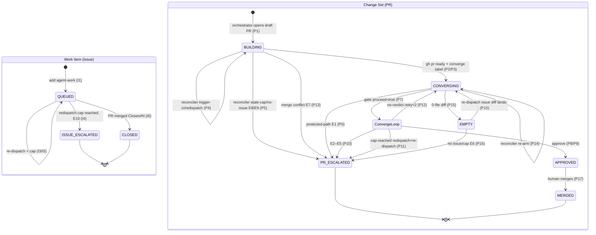
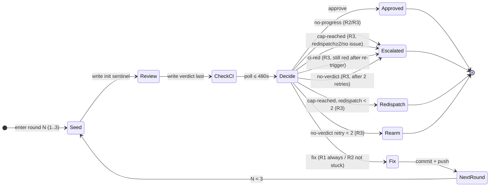

# SPEC.md — Forge-Agnostic Agent-Orchestration Engine Specification

> **Ground truth.** Every engine claim is derived from `mirror/scripts/**`,
> `mirror/.github/workflows/**`, and `mirror/.agents/custom/**`. The `mirror/ORCHESTRATION.md`
> file was stale and not used.

---

## §1 Overview

The system is a forge-agnostic, harness-agnostic autonomous SWE-agent pipeline. Two
long-lived entities move through it — **Work Items** (issues) and **Change Sets** (pull
requests) — whose state is encoded entirely in forge labels (no separate state store).
Three workflows act on those labels:

| Workflow | Role |
|---|---|
| **Dispatch** | Turns a queued Work Item (or `@claude` comment) into an implementing Change Set |
| **Converge** | A bounded 3-round Review→Fix loop that drives a Change Set to APPROVED or ESCALATED |
| **Reconciler** | Cron-driven (`*/15 * * * *`) orthogonal supervisor; detects and recovers stranded entities |

**Durability model.** Entity lifecycle state (QUEUED, BUILDING, …) is encoded in **forge
labels**. Entity counters (`redispatch_count`, `retry_count`) are stored in the service DB
with atomic increment — the DB is the authoritative counter store. Service-level data (repo
registry, operator accounts, dedup cache) is also DB-resident. A crashed process leaves
every entity in its last-written forge label state; the reconciler recovers it on the next
tick. The converge job persists its in-progress state (current round and last verdict) to
the DB so RC-3 re-arm (P14) can resume at the correct round without restarting from R1.

**Dispatch is fire-and-forget.** `HarnessPort.dispatch` returns immediately; the control
plane never blocks awaiting an agent. `Engine.converge` runs as a bounded job (P7) that
legitimately awaits its own spawned reviewers and fixers within one execution.

---

## §2 Entities & States

### Work Item (Issue)

| State | Label encoding | Meaning |
|---|---|---|
| **QUEUED** | `agent-work` | Ready for dispatch |
| **ESCALATED** | `needs-human` (`agent-work` removed) | Human decision required |
| **CLOSED** | (closed by forge merge) | Terminal-success |

### Change Set (PR)

| State | Label / draft encoding | Meaning |
|---|---|---|
| **BUILDING** | draft + `agent:implementing` | Specialists producing work |
| **CONVERGING** | ready (non-draft) + `converge` | Eligible for converge loop |
| **APPROVED** | `agent:ready` (`converge` removed) | 0 blockers + CI green; awaiting human merge |
| **ESCALATED** | `needs-human` | Human decision required |
| **MERGED** | (PR merged) | Terminal-success |
| **EMPTY** | (transient) | 0-diff PR; not a label; detected at converge gate |

Notes: `agent:implementing` is not removed when a PR is marked ready; only converge
labels toggle. The EMPTY transient state is recovered by re-dispatch, not by converging.

---

## §3 Transition Tables

### Work Item (Issue)

| # | From | To | Trigger | Guard |
|---|---|---|---|---|
| I1 | (new issue) | QUEUED | Human/agent adds `agent-work` | — |
| I2 | QUEUED | BUILDING (new PR) | Dispatch workflow `issues:labeled` | `label.name == 'agent-work'` |
| I3 | QUEUED | QUEUED (re-dispatch) | Reconciler RC-4 | no open PR, not touched <15 min, redispatch_count < 3 |
| I4 | QUEUED | ESCALATED | Reconciler RC-4 | no open PR AND redispatch_count ≥ 3 |
| I5 | QUEUED | QUEUED (re-dispatch) | Converge cap/empty-PR | re-dispatch via `@claude` |
| I6 | QUEUED / BUILDING | CLOSED | Human merges PR | `Closes #N` in PR body |

### Change Set (PR)

| # | From | To | Trigger | Guard |
|---|---|---|---|---|
| P1 | (none) | BUILDING | Orchestrator opens draft PR | draft=true, `Closes #N` |
| P2 | BUILDING | CONVERGING | Agent: `gh pr ready` + `converge` label | typecheck+lint pass |
| P3 | BUILDING | CONVERGING | Reconciler `mark-ready` / `mark-ready-and-converge` | stale draft, RC-1 |
| P4 | BUILDING | BUILDING | Reconciler `redispatch` / `trigger-ci` | stale draft, CI failing or absent |
| P5 | BUILDING | ESCALATED | Reconciler `escalate` / `needs-human` | stale + cap reached or no issue |
| P6 | CONVERGING | ESCALATED | Converge protected-path check | diff touches PROTECTED_PATHS |
| P7 | CONVERGING | CONVERGING (loop) | Converge job | non-draft, has `converge` label, idempotency gate passes |
| P8 | CONVERGING | APPROVED | Converge finalize | `approve` token: 0 blockers + CI green |
| P9 | CONVERGING | APPROVED | Converge finalize (`ci-red` recovery) | CI re-triggered and recovers within CI_WAIT_S |
| P10 | CONVERGING | ESCALATED | Converge finalize | `no-progress` / `cap-reached` / `ci-red` / `no-verdict` after retries |
| P11 | CONVERGING | ESCALATED (old PR) + re-dispatch | Converge finalize (`cap-reached`) | redispatch_count < MAX_REDISPATCHES, has issue |
| P12 | CONVERGING | CONVERGING | Converge finalize (`no-verdict`) | retry_count < NO_VERDICT_RETRY_CAP |
| P13 | CONVERGING/BUILDING | ESCALATED | Reconciler RC-2 | `mergeable == CONFLICTING` AND not already `needs-human` |
| P14 | CONVERGING | CONVERGING | Reconciler RC-3 | non-draft `converge` PR with no running workflow and no terminal label |
| P15 | CONVERGING (EMPTY) | (issue re-dispatch) | Converge gate | 0-diff PR, re-dispatch issue under redispatch cap |
| P16 | CONVERGING (EMPTY) | ESCALATED | Converge gate | 0-diff PR AND (no issue OR cap hit) |
| P17 | APPROVED | MERGED | Human merges | terminal label `agent:ready` |

**Idempotency gate** guards every CONVERGING entry: before the loop runs, returns
`proceed=false` when the PR is closed/merged, already labeled `needs-human` or
`agent:ready`, or empty.

---

## §4 Reconciler — Orthogonal Supervisor

Cron `*/15 * * * *`. Four independent channels that can run concurrently; each is
idempotent and re-entrant.

| Channel | Scopes to | Decision function | Outcomes |
|---|---|---|---|
| **RC-1 Stale-draft recovery** | Draft PRs with `agent:implementing`, last dispatch run >1200 s ago | `decide_stale_action` | `escalate`→P5 · `trigger-ci`→P4 · `mark-ready`→P3 · `mark-ready-and-converge`→P3 · `redispatch`→P4 · `needs-human`→P5 |
| **RC-2 Merge-conflict** | All open PRs | `decide_conflict_action` | `escalate`→P13 · `skip` |
| **RC-3 Converge re-arm** | Non-draft PRs labeled `converge` | `decide_rearm_action` | `trigger-ci`/`rearm`→P14 · `skip-*` |
| **RC-4 Orphan-issue** | Open `agent-work` issues | `decide_redispatch_action` | `redispatch`→I3 · `escalate`→I4 · `skip-*` |

RC-1 priority order (first match wins): redispatch_count ≥ 3 → `escalate`; ci_runs == 0 → `trigger-ci`; has_diff == 0 → `redispatch`/`needs-human`; has_converge → `mark-ready`; failing == 0 → `mark-ready-and-converge`; else → `redispatch`/`needs-human`.

---

## §5 Converge Sub-Machine (3-Round Loop)

Triggered on CONVERGING PR entry (P7). Each round: Seed → Review → Check-CI → Decide → Fix.

### Round rules

| Round | Fixer addresses | Fix step? |
|---|---|---|
| R1 | Blockers + suggestions | Yes |
| R2 | Blockers only | Yes |
| R3 | Blockers only — final review | **No** |

Nits are never fixed in-loop; accumulated nits are opened as one follow-up issue at
finalize time.

### Verdict schema

Each converge round produces a `Verdict` (written by the reviewer to `.converge-verdict.json`
on the PR branch, read by the Engine via `ForgePort.get_file_contents`):

```json
{"blockers": <int>, "suggestions": <int>, "nits": ["..."], "blocker_signatures": ["stable-slug"]}
```

**Init sentinel** (seeded before each reviewer run):
```json
{"blockers": 1, "suggestions": 0, "nits": [], "blocker_signatures": ["verdict-file-not-written"]}
```
A reviewer that crashes before overwriting the sentinel leaves a phantom blocker (fail-safe).
The string `"verdict-file-not-written"` is reserved; never use it as a real blocker slug.

`blocker_signatures` must be stable slugs (category:finding-key) that do not include
line numbers. The engine compares consecutive rounds to detect no-progress.

### Decision outcomes

| Token | Condition | Edge |
|---|---|---|
| `approve` | `blockers == 0` AND `ci_green == true` (any round) | → APPROVED (P8) |
| `fix` | R1 (always); R2 (if not stuck) | → Fix phase, next round |
| `escalate:no-progress` | R2/R3: same non-empty signatures two consecutive rounds | → ESCALATED (P10, E2) |
| `escalate:no-verdict` | R3: `blockers == "unknown"` | → retry < NO_VERDICT_RETRY_CAP (P12) else ESCALATED (P10, E3) |
| `escalate:ci-red` | R3: `blockers == 0` but CI not green | → CI re-trigger; recover→APPROVED (P9) or ESCALATED (P10, E4) |
| `escalate:cap-reached` | R3: blockers remain (≥1) | → redispatch < MAX_REDISPATCHES (P11) else ESCALATED (P10, E5) |

---

## §6 Escalation Taxonomy

| # | Cause | Origin | Condition | Entity |
|---|---|---|---|---|
| E1 | **protected-path** | `Engine.converge` setup | diff touches PROTECTED_PATHS | Change Set |
| E2 | `escalate:no-progress` | `decide_round` | same signatures two consecutive rounds | Change Set |
| E3 | `escalate:no-verdict` | `decide_round` | R3, unknown blockers, after 2 retries | Change Set |
| E4 | `escalate:ci-red` | `decide_round` | blockers clear, CI still red after re-trigger | Change Set |
| E5 | `escalate:cap-reached` | `decide_round` | R3, blockers remain, no issue or redispatch ≥ 2 | Change Set |
| E6 | **empty-PR, unrecoverable** | Converge gate | 0-diff, no closing issue or cap hit | Change Set |
| E7 | **merge-conflict** | Reconciler RC-2 | `CONFLICTING` and not already `needs-human` | Change Set |
| E8 | **stale build-cap** | Reconciler RC-1 | reconciler redispatched ≥ 3 times, CI still failing | Change Set |
| E9 | **stale no-issue** | Reconciler RC-1 | stale draft, CI failing or empty, no closing issue | Change Set |
| E10 | **issue redispatch-cap** | Reconciler RC-4 | `agent-work` issue, no PR, re-dispatched ≥ 3 times | Work Item |

---

## §7 Constants

Single-source home. All implementation code must import from this table; never hardcode.

| Constant | Value | Notes |
|---|---|---|
| `CONVERGE_ROUNDS` | `3` | R3 is final; no fix step |
| `MAX_REDISPATCHES` | `2` | Converge re-dispatch cap (`>=` escalates). **Was duplicated in 3 places in the reference impl.** |
| `RECONCILER_STALE_REDISPATCH_CAP` | `3` | RC-1 stale-PR escalate threshold |
| `ISSUE_REDISPATCH_CAP` | `3` | RC-4 orphan-issue escalate threshold |
| `STALE_DRAFT_THRESHOLD_S` | `1200` | 20 min; RC-1 trigger |
| `REARM_RECENT_GUARD_S` | `300` | 5 min; RC-3 skip-recent guard (strict `<`) |
| `ISSUE_COOLDOWN_S` | `900` | 15 min; RC-4 skip-recent guard (strict `<`) |
| `CI_WAIT_S` | `480` | 8 min; per-round CI poll timeout |
| `NO_VERDICT_RETRY_CAP` | `2` | Converge no-verdict retry cap |
| `RECONCILER_CRON` | `"*/15 * * * *"` | Reconciler cadence |
| `PARALLEL_SPECIALIST_CAP` | `4` | Max concurrent specialist agents per converge round |
| `AT_RISK_THRESHOLD` | `5` | `in_flight >= 5` → AT_RISK verdict |

### Labels

| Constant | Value |
|---|---|
| `LABEL_AGENT_WORK` | `"agent-work"` |
| `LABEL_NEEDS_HUMAN` | `"needs-human"` |
| `LABEL_IMPLEMENTING` | `"agent:implementing"` |
| `LABEL_CONVERGE` | `"converge"` |
| `LABEL_READY` | `"agent:ready"` |
| `LABEL_TRIAGE` | `"triage"` |
| `LABEL_AWAITING_PROMOTION` | `"awaiting-promotion"` |

> **Note on counter state.** Discrete entity states (QUEUED, BUILDING, …) are fully
> encoded in these labels. Counter values (`redispatch_count`, `retry_count`) are stored in
> the service DB with atomic increment/read (`CounterStore`). Marker comments (§8.2a) are
> posted alongside each counter-incrementing action as a human-visible audit trail, but the
> DB is the authoritative counter store — not the comment count. Converge round state
> (`ConvergeState`) is also persisted to the DB for RC-3 crash recovery.

### PROTECTED_PATHS

```
# from SPEC.md §7 Constants — keep in sync in agents/*.md
PROTECTED_PATHS = [
  ".github/workflows/**",   # CI workflow definitions
  "ARCHITECTURE.md",         # system architecture
  "SECURITY.md",             # threat model (formerly THREAT_MODEL.md)
  "COMPLIANCE.md",           # compliance requirements (doc not yet authored)
  ".agents/**",              # specialist pack dir
  "agents/**",               # orchestration-agent contracts
]
```

### Specialist pack constants

| Constant | Value |
|---|---|
| `CONVERGE_REVIEW_BASE` | `["engineering-security-engineer.md", "engineering-code-reviewer.md"]` |
| `SPECIALIST_ROUTING` | See §8.12 |
| `AgentPackConfig.repo_url` default | `"https://github.com/msitarzewski/agency-agents"` |
| `AgentPackConfig.pinned_ref` default | `"d6553e261e595c651064f899a6c33dd5aa71c9e3"` |
| `AgentPackConfig.dest_dir` default | `".agents"` |

### `RunState` / `RunConclusion`

Used by `HarnessPort.get_run_status` (§9.2) and consumed by `decide_rearm_action` (§8.6).

```
RunState    ∈ { "queued", "in_progress", "completed" }
RunConclusion ∈ { "success", "failure", "cancelled" }  # present only when state=="completed"
RunStatus   = { state: RunState, conclusion: RunConclusion | None }
```

### `BLOCKING_CI_CHECKS`

The ordered list of CI check names that must all be green before a converge `approve`
(P8, P9). All 6 are re-polled on the `ci-red` recovery path (see §10.2 step 4g).

| # | Name | Blocker signature slug |
|---|---|---|
| 1 | Type Check | `ci-fail:type-check` |
| 2 | Lint | `ci-fail:lint` |
| 3 | Integration Tests | `ci-fail:integration-tests` |
| 4 | Docker Build & Scan | `ci-fail:docker-build` |
| 5 | Helm Lint | `ci-fail:helm-lint` |
| 6 | Helm Kubeconform | `ci-fail:helm-kubeconform` |

A check is green when its state is `success`, `skipped`, or `neutral`.

---

## §8 Decision Functions

All decision functions are **pure and synchronous** unless noted. No network, no file I/O,
no side effects. They must never be made async.

Exceptions: `resolve_blockers` and `pipeline_health` are impure (they call `ForgePort`
methods). `derive_redispatch_count` and `derive_retry_count` are replaced by DB counter
reads (see §8.2a). In tests, the fake `ForgePort` and `CounterStore` are injected.

**Type validation** is enforced by function signatures. Truth tables document decision
logic only; callers receive a `TypeError` (Python) or compile error (Rust) for wrong-typed
arguments. The "usage error, exit 2" convention of the bash reference implementation is
retired.

Priority tables are evaluated top-to-bottom; first match fires.

### §8.1 `route_entry`

Maps a forge event name to entry parameters.

**Inputs**: `event: string`
**Outputs**: `{model, max_turns, contract}`

| # | Condition | `model` | `max_turns` |
|---|---|---|---|
| 1 | `event == "issues"` | `claude-opus-4-8` | `40` |
| 2 | `event ∈ {issue_comment, pull_request_review_comment}` | `claude-sonnet-4-6` | `30` |
| 3 | else (unknown / empty) | `claude-sonnet-4-6` | `30` |

`contract` = `orchestrator-contract.md` (constant across all branches). Exit 0 for all
inputs including unknown/empty.

### §8.2 `resolve_blockers`

Resolves the effective blocker count for one converge round, falling back from the
verdict JSON to the reviewer's comment footer when the sentinel survived.

**Inputs**: `pr_ref`, `round: int`, `round_started: datetime | None`
**Output**: `int | Literal["unknown"]`

The Engine reads the verdict via `ForgePort.get_file_contents(pr_ref, ".converge-verdict.json")`.
A verdict is sentinel iff `blocker_signatures` contains `"verdict-file-not-written"`.

| # | Condition | Output |
|---|---|---|
| 1 | file present and not sentinel | `.blockers` from JSON, or `"unknown"` if missing/non-numeric |
| 2 | sentinel or file absent; `round_started` is not None | pick most-recent comment footer posted after `round_started` |
| 3 | sentinel or file absent; `round_started` is None | pick most-recent comment footer regardless of age |
| 4 | no footer resolved | `"unknown"` |

`parse_comment_blockers` extracts `🔴 <N> blockers` via regex. The in-round filter
(`comment.created_at >= round_started`) scopes the search to the current round when
provided, preventing stale footers from prior rounds from bleeding through.

### §8.2a `CounterStore` — counter reads and increments

Counters are stored in the service DB with atomic increment. The `CounterStore` port
provides the interface:

```
async get_count(entity_ref, channel: str) -> int
async increment(entity_ref, channel: str) -> int   # returns new value; atomic
async reset(entity_ref, channel: str) -> void
```

| `channel` | Entity | Cap constant | Consumed by |
|---|---|---|---|
| `"converge"` | issue | `MAX_REDISPATCHES` | `decide_cap_action` |
| `"stale-pr"` | PR | `RECONCILER_STALE_REDISPATCH_CAP` | `decide_stale_action` |
| `"orphan"` | issue | `ISSUE_REDISPATCH_CAP` | `decide_redispatch_action` |
| `"converge-retry"` | PR | `NO_VERDICT_RETRY_CAP` | converge no-verdict retry |

Each Engine action that increments a counter also posts a human-visible action comment on
the forge entity (for audit trail). The comment body includes a namespaced marker for
human readability, but the **DB counter is authoritative** — not the comment count:

| Channel | Marker (audit trail only) |
|---|---|
| `"converge"` | `<!-- orchestrator:redispatch ch=converge -->` |
| `"stale-pr"` | `<!-- orchestrator:redispatch ch=stale-pr -->` |
| `"orphan"` | `<!-- orchestrator:redispatch ch=orphan -->` |
| `"converge-retry"` | `<!-- orchestrator:converge-retry -->` |

The `CounterStore` is injected into the `Engine` alongside the three port interfaces; the
fake `CounterStore` is used in all unit and integration tests.

### §8.3 `decide_round`

Decides the convergence action for one round.

**Inputs**: `round: int ∈ {1,2,3}`, `blockers: int | Literal["unknown"]`,
`ci_green: bool`, `prev_sigs: list[str]`, `curr_sigs: list[str]`

Sentinel normalization: any list equal to `["verdict-file-not-written"]` → `[]`.

| # | Condition | Output |
|---|---|---|
| 1 | `blockers == 0 and ci_green` | `approve` |
| 2 | `round == 1` | `fix` |
| 3 | `curr_sigs == prev_sigs and curr_sigs != [] and blockers not in (0, "unknown")` | `escalate:no-progress` |
| 4 | `round == 2` | `fix` |
| 5 | `round == 3 and blockers == "unknown"` | `escalate:no-verdict` |
| 6 | `round == 3 and blockers == 0` (ci not green, else row 1) | `escalate:ci-red` |
| 7 | `round == 3` else (blockers ≥ 1) | `escalate:cap-reached` |

Key edges: `"unknown"` never produces `approve`; empty `prev==curr==[]` is NOT
no-progress (row 3 requires non-empty `curr_sigs`); row 3 fires before rows 5–7 in R3.

### §8.4 `decide_cap_action`

When converge cap is reached with blockers, decides whether to re-dispatch or escalate.

**Inputs**: `redispatch_count: int`, `has_issue: bool`
**Constant**: `MAX_REDISPATCHES = 2`

| # | Condition | Output |
|---|---|---|
| 1 | `not has_issue` | `escalate` |
| 2 | `redispatch_count >= MAX_REDISPATCHES` | `escalate` |
| 3 | else | `redispatch` |

### §8.5 `decide_stale_action`

Decides recovery action for a stale draft PR carrying `agent:implementing`.

**Inputs**: `redispatch_count: int`, `ci_runs: int`, `has_converge: bool`,
`failing_count: int`, `has_issue: bool`, `has_diff: bool`

| # | Condition | Output |
|---|---|---|
| 1 | `redispatch_count >= RECONCILER_STALE_REDISPATCH_CAP` | `escalate` |
| 2 | `ci_runs == 0` | `trigger-ci` |
| 2.5a | `not has_diff and has_issue` | `redispatch` |
| 2.5b | `not has_diff and not has_issue` | `needs-human` |
| 3 | `has_converge` | `mark-ready` |
| 4 | `failing_count == 0` | `mark-ready-and-converge` |
| 5 | `has_issue` | `redispatch` |
| 6 | else (failing, no issue) | `needs-human` |

Priority 2.5 key: an empty (no-diff) PR must be re-dispatched even when it carries the
`converge` label — the label was added at PR creation and is not evidence of finished work.
Rows 1 and 2 win over this guard.

### §8.6 `decide_rearm_action`

For a non-draft converge PR, decides whether to trigger CI, re-arm, or skip.

**Inputs**: `ci_runs: int`, `run: RunStatus | None`, `has_terminal_label: bool`,
`seconds_since_last_run: int | None`

`run` is the result of `HarnessPort.get_run_status` for the most recent converge run on
this PR, or `None` if no run exists (see §9.2 for `RunStatus` type).

| # | Condition | Output |
|---|---|---|
| 1 | `ci_runs == 0` | `trigger-ci` |
| 2 | `run is not None and run.state in ("queued", "in_progress")` | `skip-in-progress` |
| 3 | `run is not None and run.state == "completed" and run.conclusion == "success" and has_terminal_label` | `skip-done` |
| 4 | `seconds_since_last_run is not None and seconds_since_last_run < REARM_RECENT_GUARD_S` | `skip-recent` |
| 5 | else | `rearm` |

Row 2 folds `queued` and `in_progress` to prevent duplicate dispatch.
Exactly `REARM_RECENT_GUARD_S` seconds = NOT recent. `None` seconds skips the recency
guard. Any `completed` run with non-`success` conclusion falls through to `rearm`.

### §8.7 `decide_conflict_action`

**Inputs**: `mergeable: str`, `already_needs_human: bool`

| # | Condition | Output |
|---|---|---|
| 1 | `mergeable == "CONFLICTING" and not already_needs_human` | `escalate` |
| 2 | else | `skip` |

Only exact string `"CONFLICTING"` triggers escalation.

### §8.8 `decide_redispatch_action`

For an `agent-work` issue with no open PR.

**Inputs**: `has_open_pr: bool`, `seconds_since_last_activity: int | None`,
`redispatch_count: int`

| # | Condition | Output |
|---|---|---|
| 1 | `has_open_pr` | `skip-has-pr` |
| 2 | `seconds_since_last_activity is not None and seconds_since_last_activity < ISSUE_COOLDOWN_S` | `skip-recent` |
| 3 | `redispatch_count >= ISSUE_REDISPATCH_CAP` | `escalate` |
| 4 | else | `redispatch` |

Exactly `ISSUE_COOLDOWN_S` seconds = NOT recent. `None` (never touched) skips recency guard.

### §8.9 `pipeline_health`

Reports pipeline health for a repo. Impure — calls `ForgePort.list_prs`.

**Inputs**: `repo: RepoRef`
**Output**: `HealthReport` — fields: `implementing`, `converge`, `ready`, `needs_human`,
`stale_drafts`, `in_flight`, `report_md`, `verdict`

Counts: `implementing` = PRs with `agent:implementing`; `converge` = PRs with `converge`;
`ready` = PRs with `agent:ready`; `needs_human` = PRs with `needs-human`;
`stale_drafts` = draft PRs with `agent:implementing`; `in_flight = implementing + converge`

| # | Condition | verdict |
|---|---|---|
| 1 | `needs_human > 0` | `BLOCKED` |
| 2 | `in_flight >= AT_RISK_THRESHOLD` | `AT_RISK` |
| 3 | else | `ON_TRACK` |

`BLOCKED` wins over `AT_RISK` when both conditions hold.

### §8.10 `derive_issue_state` / `derive_pr_state`

Pure label→state projection functions. Synchronous. No I/O.

`derive_issue_state(labels, closed)` → `IssueState`:
- `closed == true` → `CLOSED` (beats all labels)
- `needs-human ∈ labels` → `ESCALATED`
- else → `QUEUED`

`derive_pr_state(labels, draft, merged, changed_files)` → `PRState`:
- `merged == true` → `MERGED` (beats all)
- `needs-human ∈ labels` → `ESCALATED`
- `agent:ready ∈ labels` → `APPROVED`
- `changed_files == 0` AND not draft → `EMPTY`
- `converge ∈ labels` AND not draft → `CONVERGING`
- else (draft or no labels) → `BUILDING`

### §8.11 `decide_intake`

| `allowlist` | `author in allowlist` | Result |
|---|---|---|
| empty (`[]`) | n/a | `admit` — gate disabled |
| non-empty | true | `admit` |
| non-empty | false | `queue` |

Pure, synchronous, no forge calls. Exact string equality (no case folding, no fuzzy match).
Side effects (label writes) are performed by `Engine.intake`, not this function.

### §8.12 `decide_specialists`

```
decide_specialists(changed_paths: list<string>, round: int) -> list<AgentRef>
```

Pure synchronous. Returns 2–4 `AgentRef` values.

**Algorithm:**
1. Start with `CONVERGE_REVIEW_BASE` (always-on: security + code-quality reviewers).
2. For each entry in `SPECIALIST_ROUTING`, test whether any `changed_path` matches the glob.
3. Add matching `AgentRef` (deduplicate against base set).
4. Cap at `PARALLEL_SPECIALIST_CAP = 4`; base set is always retained; routing specialists
   dropped (in definition order) to respect cap.

`round` is passed but currently unused; reserved for future per-round suppression.

**`SPECIALIST_ROUTING`:**

| Glob pattern(s) | AgentRef |
|---|---|
| `**/migrations/**`, `**/*.sql`, `**/schema*` | `engineering-database-optimizer.md` |
| `**/*.tsx`, `**/*.css`, `**/components/**`, `**/ui/**` | `testing-accessibility-auditor.md` |
| `**/api/**`, `**/routes/**`, `**/handlers/**` | `testing-api-tester.md` |

Security (`engineering-security-engineer.md`) is always in the base set and is also the
default for auth/session/crypto patterns (already included via base).

**Invariant (I9):** `AgentRef` values come only from this function's output; contributor
text is never interpolated into an `AgentRef` string.

---

## §9 Ports

All port methods are **async** (they perform I/O).

### §9.1 ForgePort

```
async get_issue(issue_ref) -> Issue
async list_issues(repo, labels) -> list<Issue>
async add_label(entity_ref, label: string) -> void
async remove_label(entity_ref, label: string) -> void
async create_pr(repo, title, body, head, base, draft) -> PRRef
async get_pr(pr_ref) -> PR
async list_prs(repo, state, labels) -> list<PR>
async set_pr_ready(pr_ref) -> void
async get_changed_files(pr_ref) -> list<string>
async get_check_runs(pr_ref) -> list<CheckRun>
async get_mergeable(pr_ref) -> string        # "MERGEABLE" | "CONFLICTING" | "UNKNOWN"
async list_comments(entity_ref, since: datetime | None = None) -> list<Comment>
async post_comment(entity_ref, body: string) -> void
async create_review(pr_ref, event, body) -> void
async create_issue(repo, title, body) -> IssueRef
async get_file_contents(pr_ref, path: string) -> bytes | None
async last_workflow_run_at(pr_ref, workflow_name) -> datetime | null
async last_dispatch_run_at(pr_ref) -> datetime | null
```

`list_comments` returns comments in chronological order. When `since` is provided, only
comments created at or after that timestamp are returned. Implementations must paginate
transparently — callers always receive the full result.

`get_file_contents` fetches a file at `path` from the HEAD of the PR's branch; returns
`None` when the file does not exist. Used by `resolve_blockers` to read `.converge-verdict.json`.

### §9.2 HarnessPort

```
async dispatch(context: DispatchContext) -> RunHandle
```

Single-shot: returns immediately; engine never blocks awaiting the agent.

```
async trigger_workflow(name: string, ref, inputs: dict) -> void
async trigger_ci(pr_ref) -> void
async get_run_status(handle: RunHandle) -> RunStatus
```

`RunStatus = { state: RunState, conclusion: RunConclusion | None }` (see §7 for enum values).

Specialists are spawned via `dispatch` with an `AgentRef`-derived prompt. `AgentRef` values
come only from `decide_specialists` output (invariant I9). Depth-1 only; specialists must
not spawn further sub-agents.

### §9.3 SessionPort

```
async list_runs(repo, since: datetime | None = None, status: str | None = None,
                type: str | None = None) -> list<RunSummary>
async get_run(run_id: str) -> RunDetail
async stream_events(run_id: str) -> AsyncIterator<Event>
async cancel(run_id: str) -> void
async intervene(run_id: str, message: string) -> void
```

`run_id` is the stable string identifier for a run, serialized from a `RunHandle`.
Does not alter forge label state. Cancellation leaves the entity in its last-written
label state; the reconciler recovers it on the next tick.

---

## §10 Engine Methods

The `Engine` is stateless per-call. Constructed with
`(ForgePort, HarnessPort, SessionPort, CounterStore)`. Holds no durable in-process state
other than the arguments passed to each method.

### §10.1 `Engine.dispatch`

Entry from `issues:labeled` (I2, P1) or `@claude` comment (I5).

1. `route_entry(event.name)` → `{model, max_turns, contract}`.
2. For `issues:labeled agent-work` → `harness.dispatch(DispatchContext(issue_ref, ...))`.
3. For `@claude` comment → `harness.dispatch(DispatchContext(pr_ref or issue_ref, ...))`.

Covers I2, P1, I5.

### §10.2 `Engine.converge`

Entry on `pull_request:ready_for_review`, `labeled:converge`, or `synchronize` (P2, P7).

1. **Idempotency gate** — read PR label state; return immediately if closed/merged/terminal.
2. **Protected-path check** — `forge.get_changed_files(pr)` vs `PROTECTED_PATHS`. On match:
   `forge.add_label(pr, LABEL_NEEDS_HUMAN)` → return `ESCALATED` (P6, E1).
3. **EMPTY check** — 0 changed files: read `redispatch_count = await counter.get_count(issue_ref, "converge")` then `decide_cap_action(redispatch_count, has_issue)`:
   - `redispatch` → post `@claude` comment on issue (audit marker: `<!-- orchestrator:redispatch ch=converge -->`); `await counter.increment(issue_ref, "converge")` (P15, I5)
   - `escalate` → `forge.add_label(pr, LABEL_NEEDS_HUMAN)` → `ESCALATED` (P16, E6)
4. **Converge loop** (rounds 1–3). This loop runs inside one converge job (P7), legitimately
   awaiting its own spawned agents and polling CI. The Engine persists round state to the DB
   after each completed round so RC-3 re-arm (P14) can resume at the correct round:
   a. Determine start round: `start = db.get_converge_round(pr_ref) + 1` (default 1 if none saved).
   b. For each round `r` from `start` to 3:
      - Seed init sentinel via `forge.post_comment` so the reviewer sees a known starting state.
      - Dispatch reviewers: `decide_specialists(changed_paths, r)` → `harness.dispatch` for each (up to `PARALLEL_SPECIALIST_CAP`); record `handles`.
      - **Await reviewers**: poll `harness.get_run_status(h)` for each `h` in `handles`; loop until all reach `completed` or `CI_WAIT_S` elapses.
      - Record `round_started` timestamp before dispatching; poll `forge.get_check_runs(pr)` for CI.
      - `resolve_blockers(pr_ref, r, round_started)` → `int | "unknown"`.
      - `decide_round(r, blockers, ci_green, prev_sigs, curr_sigs)` → token.
      - Persist: `db.set_converge_round(pr_ref, r)`.
   c. Act on token:
      - `approve` → add `LABEL_READY`, remove `LABEL_CONVERGE`, post approving review; `forge.create_issue` for accumulated nits → `APPROVED` (P8).
      - `fix` (R1/R2) → `harness.dispatch` fixer agent(s); advance to next round.
      - `escalate:no-progress` → `forge.add_label(pr, LABEL_NEEDS_HUMAN)` → `ESCALATED` (P10, E2).
      - `escalate:no-verdict` → `retry_count = await counter.get_count(pr_ref, "converge-retry")` then: if `retry_count < NO_VERDICT_RETRY_CAP`: post re-arm comment (audit marker: `<!-- orchestrator:converge-retry -->`); `await counter.increment(pr_ref, "converge-retry")`; re-arm (P12); else `LABEL_NEEDS_HUMAN` (P10, E3).
      - `escalate:ci-red` → `harness.trigger_ci(pr)`; poll **all 6 `BLOCKING_CI_CHECKS`** up to `CI_WAIT_S`; if all green → `approve` (P9); else `LABEL_NEEDS_HUMAN` (P10, E4).
      - `escalate:cap-reached` → `redispatch_count = await counter.get_count(issue_ref, "converge")` then `decide_cap_action(redispatch_count, has_issue)`:
        - `redispatch` → add `LABEL_NEEDS_HUMAN` to current PR (P11, abandons old converging PR); post `@claude` comment on issue (audit marker: `<!-- orchestrator:redispatch ch=converge -->`); `await counter.increment(issue_ref, "converge")`.
        - `escalate` → `forge.add_label(pr, LABEL_NEEDS_HUMAN)` (P10, E5).

### §10.3 `Engine.reconcile`

Runs the four RC channels concurrently; returns `ReconcileReport`.

```
ReconcileReport {
  stale_acted: int, conflicts_flagged: int, rearmed: int, redispatched: int, escalated: int
}
```

Channels are independent and may run concurrently (they operate on disjoint entity sets).
Within each channel, entities are processed serially to avoid conflicting label writes.

**Counter reads and increments in reconcile channels:**
- **RC-1 (stale-draft):** `redispatch_count = await counter.get_count(pr_ref, "stale-pr")` before calling `decide_stale_action`. When acting `redispatch`: post action comment (audit marker: `<!-- orchestrator:redispatch ch=stale-pr -->`); `await counter.increment(pr_ref, "stale-pr")`.
- **RC-4 (orphan-issue):** `redispatch_count = await counter.get_count(issue_ref, "orphan")` before calling `decide_redispatch_action`. When acting `redispatch`: post `@claude` comment (audit marker: `<!-- orchestrator:redispatch ch=orphan -->`); `await counter.increment(issue_ref, "orphan")`.

### §10.4 `Engine.intake`

Entry on `issues:opened`/`issues:reopened` when `repo.intake_enabled == true`.

1. Dispatch triager agent via `harness.dispatch` (read-only; posts one structured comment).
2. `decide_intake(event.actor, repo.allowlist)` → `{admit, queue}`.
3. `admit` → `forge.add_label(issue, LABEL_TRIAGE)` + `forge.add_label(issue, LABEL_AGENT_WORK)` → fires `issues:labeled` → I2.
4. `queue` → `forge.add_label(issue, LABEL_TRIAGE)` + `forge.add_label(issue, LABEL_AWAITING_PROMOTION)` → issue appears in PWA triage queue.

---

## §11 Service Contract

### §11.1 Event routing

`handle_event` routes a `ForgeEvent` (evaluated top-to-bottom, first match wins):

| `name` | `action` | condition | Routes to |
|---|---|---|---|
| `issues` | `opened` / `reopened` | `intake_enabled == true` | `Engine.intake` |
| `issues` | `labeled` | `label == LABEL_AGENT_WORK` | `Engine.dispatch` |
| `issue_comment` | any | body contains `@claude` | `Engine.dispatch` |
| `pull_request_review_comment` | any | body contains `@claude` | `Engine.dispatch` |
| `pull_request` | `ready_for_review` | — | `Engine.converge` |
| `pull_request` | `labeled` | `label == LABEL_CONVERGE` | `Engine.converge` |
| `pull_request` | `synchronize` | — | `Engine.converge` |
| cron tick | — | — | `Engine.reconcile` per enabled repo |
| anything else | — | — | no-op |

`synchronize` is safe because `Engine.converge` begins with the idempotency gate.

### §11.2 Configuration types

```
SwarmLimits { max_concurrent_runs_global: int, max_concurrent_runs_per_repo: int, max_concurrent_reconciles: int }
# sane defaults: global=10, per_repo=4, reconciles=4

RepoConfig { repo: RepoRef, enabled: bool, intake_enabled: bool = true, allowlist: list<string> }

Config { repos: list<RepoConfig>, limits: SwarmLimits, agent_pack: AgentPackConfig,
         reconcile_cron: string = "*/15 * * * *", dedup_window: int }
```

`allowlist` empty = gate disabled (all authors admit). `intake_enabled = false` skips
the triage front-stage entirely (for private/fully-trusted repos).

`PortProvider.ports(repo: RepoRef) -> (ForgePort, HarnessPort, SessionPort)` — holds
credentials; never exposed to the Engine or control plane.

### §11.3 OrchestratorService

Constructed with `(provider: PortProvider, config: Config, counter_store: CounterStore)`.
Owns the in-memory repo registry, delivery-ID dedup cache (backed by DB for multi-replica
correctness), and SwarmLimits semaphores (backed by DB when running >1 replica). Per-event
and per-repo errors are isolated.

```
async start() -> void           # begin reconcile cadence loop
async stop() -> void            # drain in-flight tasks
async handle_event(event: ForgeEvent) -> EventOutcome
async reconcile_now(repo: RepoRef | null) -> list<ReconcileReport>
async status(repo: RepoRef | null) -> list<HealthReport>

# Repo management (all sync; write-through to DB)
register_repo(cfg: RepoConfig) -> void
unregister_repo(repo: RepoRef) -> void
pause_repo(repo: RepoRef) -> void
resume_repo(repo: RepoRef) -> void
list_repos() -> list<RepoConfig>

# Run observation and control
async list_runs(repo, since, status, type) -> list<RunSummary>
async get_run(run_id: str) -> RunDetail
async cancel_run(run_id: str) -> void
async intervene_run(run_id: str, message) -> void

# Triage (human intake gate)
async list_triage(repo: RepoRef | null) -> list<TriageItem>
async promote(repo, issue_ref, operator: str) -> void   # remove AWAITING_PROMOTION, add AGENT_WORK; writes audit record
async decline(repo, issue_ref, operator: str, comment: str | None) -> void  # close issue; writes audit record

# Config mutation
async update_config(patch: ConfigPatch) -> Config       # updates SwarmLimits, reconcile_cron, dedup_window

# Auth and operator management (implemented by the HTTP API layer; not on the service class)
# → see WEBUI.md §6 for POST /api/auth, /api/operators, /api/push/* endpoints
```

`handle_event` steps: (1) dedup check on `delivery_id` (DB-backed, safe under N replicas);
(2) repo lookup; (3) routing; (4) acquire per-entity advisory lock (prevents concurrent
converge on the same PR); (5) `provider.ports(repo)` → `Engine`; (6) invoke method;
(7) release lock and semaphore.

The advisory lock (step 4) is the concurrency-safety mechanism for the idempotency gate —
it replaces the read-then-act race with a serialized check-and-act. Leader election is not
required; all replicas may accept events and the DB lock serializes per-entity work.

---

## §12 State Diagrams

### §12.1 Full lifecycle



### §12.2 Converge round sub-machine



---

## §13 Known Issues

**OQ-1 (resolved): `ci-red` recovery now re-polls all 6 blocking CI checks.** The former
3-of-6 behaviour (inherited from the reference bash implementation) was a soundness hole:
a PR that recovered Type Check / Lint / Integration Tests but still had red Docker Build,
Helm Lint, or Helm Kubeconform could be auto-approved (P9). `Engine.converge §10.2` step
4g now polls all `BLOCKING_CI_CHECKS` (§7) before approving. The negative test
`test_converge_ci_red_docker_still_red_escalates` locks in the corrected behaviour.

**OQ-2: `MAX_REDISPATCHES` was duplicated in three places** in the reference bash
scripts. It is now single-sourced here. Never hardcode `2` in implementation code.

**OQ-3: Two redispatch caps with different values** govern overlapping situations:
`MAX_REDISPATCHES = 2` (converge), `RECONCILER_STALE_REDISPATCH_CAP = 3` (RC-1),
`ISSUE_REDISPATCH_CAP = 3` (RC-4). These are distinct for distinct situations; do not
unify them without a human decision.

**OQ-4: `COMPLIANCE.md`** is in `PROTECTED_PATHS` but has not been authored yet. Its
presence in the list is intentional — it reserves the slot. See `SECURITY.md` for the
one-line note.
