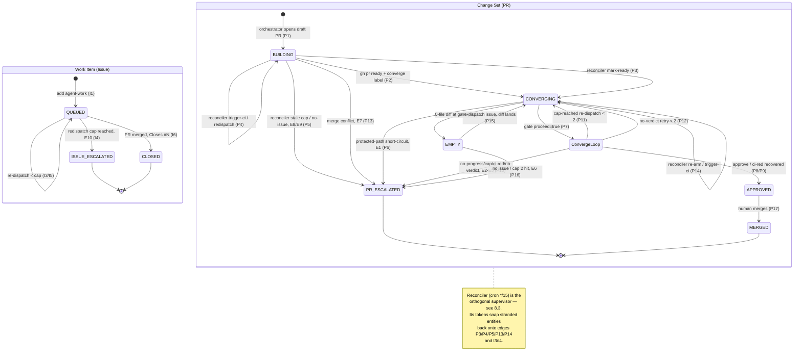
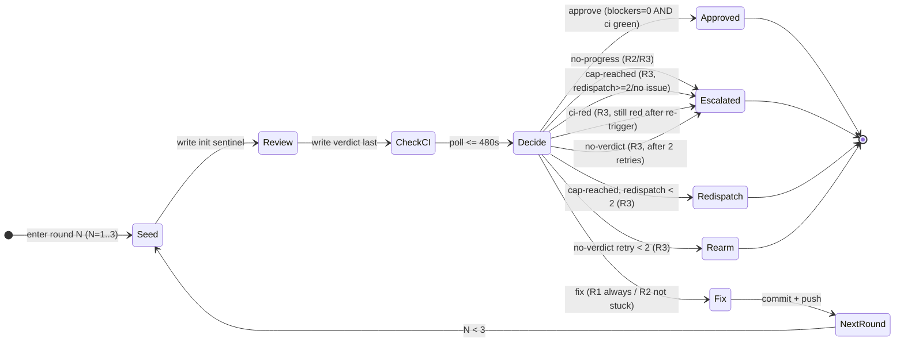

# STATE_MACHINE.md — Forge-Agnostic Agent-Orchestration State Machine

**Version**: 1.0
**Date**: 2026-06-20
**Author**: Workflow Architect
**Status**: Draft (clean-room spec derived from the Mirror reference implementation)
**Source of truth**: the decision scripts, workflows, and contracts under
`mirror/scripts/**`, `mirror/.github/workflows/**`, and `mirror/.agents/custom/**`.
This document is the centerpiece. Per-function input→output truth tables live in
`DECISION_LOGIC.md`; this file references them rather than reproducing them.

> **Provenance note.** `mirror/ORCHESTRATION.md` is **stale** and was NOT used as
> a source. It names a dead `receptionist-dispatcher.md` Haiku routing job
> (`ORCHESTRATION.md:101,133`) that no longer exists — the real entry path is the
> deterministic `decide-entry.sh` → `orchestrator-contract.md`
> (`dispatch.yml:97-103`, `decide-entry.sh:24`). It also claims "**only four
> legitimate `needs-human` triggers**" (`ORCHESTRATION.md:69`), which **undercounts**
> the real escalation taxonomy (see §6 — there are at least eight distinct causes).
> Every claim below is cited to a script/workflow/contract line.

---

## 1. Overview

The system is a **forge-agnostic, harness-agnostic** autonomous SWE-agent pipeline.
Two long-lived entities move through it; their state is **encoded entirely in
labels** on the forge (GitHub) objects — there is no separate state store. Three
workflows act on those labels:

| Workflow | File | Role |
|---|---|---|
| **Dispatch** | `dispatch.yml` | Entry point. Turns a queued Work Item (or an `@claude` comment) into an implementing Change Set. |
| **Converge** | `pr-converge.yml` | A bounded 3-round Review→Fix sub-machine that drives a Change Set to APPROVED or ESCALATED. |
| **Reconciler** | `agent-reconciler.yml` | An **orthogonal supervisor** (cron `*/15`, plus PR push) that detects and recovers stranded entities. |

The harness (`anthropics/claude-code-action`) is **single-shot**: an agent that
yields its turn is killed with no resume (`orchestrator-contract.md:74-80`,
`converge-reviewer.md:51-56`). Durability therefore comes from **committing early
and often** plus the reconciler supervisor — not from in-process waiting.

---

## 2. Entities & States

### Entity A — Work Item (a GitHub Issue)

| State | Label encoding | Meaning |
|---|---|---|
| **QUEUED** | `agent-work` | Ready for dispatch. Adding this label is the trigger (`dispatch.yml:14`). |
| **ESCALATED** | `needs-human` (`agent-work` removed) | A human decision is required. Reached by the issue-redispatch cap (`agent-reconciler.yml:341-344`). |
| **CLOSED** | (issue closed by merge) | Terminal-success. The Change Set's `Closes #N` body closes the issue when the PR merges. |

### Entity B — Change Set (a GitHub Pull Request)

| State | Label / draft encoding | Meaning |
|---|---|---|
| **BUILDING** | draft + `agent:implementing` | Orchestrator/specialists are producing work. `agent:implementing` is stamped after the agent step (`dispatch.yml:180-191`). |
| **CONVERGING** | ready (non-draft) + `converge` | Eligible for the converge loop. The `converge` label is added only at the "ready" step (`orchestrator-contract.md:188`, `implementation-contract.md:43`); converge fires on `ready_for_review` or `labeled:converge` (`pr-converge.yml:15-17,112-120`). |
| **APPROVED** | `agent:ready` (`converge` removed) | Converged: 0 blockers + CI green. Awaiting human merge (`pr-converge.yml:564`). |
| **ESCALATED** | `needs-human` | A human decision is required. Multiple causes — see §6. |
| **MERGED** | (PR merged) | Terminal-success. Human merges an APPROVED PR; this closes the linked issue. |

> **Refinement vs. the brief.** The prompt's draft model holds. Two clarifications
> the code forces:
> 1. `agent:implementing` is **not removed** when the PR is marked ready — only
>    `converge`/`agent:ready`/`needs-human` are toggled by converge. The reconciler
>    *does* strip `agent:implementing` when it escalates a stale draft
>    (`agent-reconciler.yml:144-145,179-180,211`).
> 2. There is a transient pre-state, **EMPTY**: a PR whose diff vs. `master` is
>    zero files. It is not a label; it is detected at the converge gate
>    (`pr-converge.yml:71-101`) and by the reconciler (`decide-stale-action.sh:56-63`),
>    and is recovered by re-dispatch, not by converging a zero-line diff.

---

## 3. Transition Table

Each row: **from → to | trigger / actor | guard / condition**. `RC-*` markers in
the reconciler region (§4) are listed separately to keep the main graph readable.

### Work Item (Issue) transitions

| # | From | To | Trigger / actor | Guard / condition |
|---|---|---|---|---|
| I1 | (new issue) | QUEUED | Human/agent adds `agent-work` | — |
| I2 | QUEUED | BUILDING (new PR) | Dispatch workflow | `issues:labeled` AND `label.name == 'agent-work'` (`dispatch.yml:14`); orchestrator opens a draft PR closing this issue |
| I3 | QUEUED | QUEUED (re-dispatch) | Reconciler step 4 | no open PR refs issue, not touched <15 min, redispatch_count < 3 → `redispatch` (`decide-redispatch-action.sh:38-50`) |
| I4 | QUEUED | ESCALATED | Reconciler step 4 | no open PR AND redispatch_count ≥ 3 → `escalate`; swaps `agent-work`→`needs-human` (`decide-redispatch-action.sh:44-46`, `agent-reconciler.yml:341-344`) |
| I5 | QUEUED | QUEUED (re-dispatch) | Converge cap / empty-PR | converge re-dispatches the closing issue via `@claude` (`pr-converge.yml:89-92`, `pr-converge.yml:641-646`) |
| I6 | QUEUED / BUILDING | CLOSED | Human merges the PR | PR body `Closes #N` (`orchestrator-contract.md:32`) |

### Change Set (PR) transitions

| # | From | To | Trigger / actor | Guard / condition |
|---|---|---|---|---|
| P1 | (none) | BUILDING | Orchestrator opens draft PR | first commit early, draft PR, `Closes #N` (`orchestrator-contract.md:26-36`) |
| P2 | BUILDING | CONVERGING | Agent calls `gh pr ready` after `converge` label | typecheck+lint pass, then `--add-label converge` + `gh pr ready` (`orchestrator-contract.md:186-190`, `implementation-contract.md:38-45`) |
| P3 | BUILDING | CONVERGING | **Reconciler** `mark-ready` / `mark-ready-and-converge` | stale draft, see RC-1a/RC-1b in §4 |
| P4 | BUILDING | BUILDING (re-dispatch) | **Reconciler** `redispatch` / `trigger-ci` | stale draft, CI failing or absent, see RC-1c |
| P5 | BUILDING | ESCALATED | **Reconciler** `escalate` / `needs-human` | stale draft, cap reached or no issue, see RC-1d |
| P6 | CONVERGING | **ESCALATED (short-circuit)** | Converge setup step | **protected-path** diff touches `.github/workflows/**`, `ARCHITECTURE.md`, `THREAT_MODEL.md`, or `COMPLIANCE.md` → label `needs-human`, **`exit 0` before any review round** (`pr-converge.yml:154-166`) |
| P7 | CONVERGING | CONVERGING (loop) | Converge job | gate `proceed==true`, non-draft, has `converge` label (`pr-converge.yml:112-120`); runs the §5 sub-machine |
| P8 | CONVERGING | APPROVED | Converge finalize | final action `approve` → `--add-label agent:ready --remove-label converge` + approving review (`pr-converge.yml:561-564`) |
| P9 | CONVERGING | APPROVED | Converge finalize (`ci-red` recovery) | blockers clear, CI re-triggered, recovers green within 8 min → approve (`pr-converge.yml:596-614`) |
| P10 | CONVERGING | ESCALATED | Converge finalize | final action `escalate:no-progress` / `escalate:cap-reached` (cap hit, no issue or redispatch cap) / `escalate:ci-red` (still red) / `escalate:no-verdict` (after 2 retries) → `needs-human` (`pr-converge.yml:566-663`) |
| P11 | CONVERGING | BUILDING-ish (re-dispatch) | Converge finalize (`cap-reached`) | cap hit, has issue, redispatch_count < 2 → `@claude` re-dispatch on the issue (`pr-converge.yml:638-649`, `decide-cap-action.sh:45-56`). The PR stays `converge`-labeled and re-enters via P7 once a new diff lands. |
| P12 | CONVERGING | CONVERGING (no-verdict retry) | Converge finalize (`no-verdict`) | retry_count < 2 → re-arm full converge from round 1 via `workflow_dispatch` (`pr-converge.yml:583-590`) |
| P13 | CONVERGING / BUILDING | ESCALATED | **Reconciler** merge-conflict | `mergeable == CONFLICTING` AND not already `needs-human` → `escalate` (`decide-conflict-action.sh:24-27`, `agent-reconciler.yml:201-211`) |
| P14 | CONVERGING | CONVERGING (re-arm) | **Reconciler** `rearm` / `trigger-ci` | non-draft `converge` PR with no running converge and no terminal label, see RC-3 |
| P15 | CONVERGING (EMPTY) | (issue re-dispatch) | Converge gate / reconciler | 0 changed files → remove `converge`, re-dispatch issue under cap 2 (gate) / `redispatch` (reconciler) (`pr-converge.yml:71-101`, `decide-stale-action.sh:56-63`) |
| P16 | CONVERGING (EMPTY) | ESCALATED | Converge gate | 0 changed files AND (no issue OR redispatch cap 2 hit) → `needs-human` (`pr-converge.yml:94-100`) |
| P17 | APPROVED | MERGED | Human merges | terminal label `agent:ready` present; reconciler treats `agent:ready` as `skip-done` (`decide-rearm-action.sh:47-51`) |

**Idempotency gate (guards every CONVERGING entry).** Before the loop runs, the
gate job (`pr-converge.yml:35-105`) returns `proceed=false` when the PR is
closed/merged, already labeled `needs-human` or `agent:ready`, or empty. This
prevents a reconciler re-arm from re-reviewing an already-finished PR
(`pr-converge.yml:56-58`).

---

## 4. Reconciler — Orthogonal Supervisor Region

The reconciler is **not** an inline edge in the main graph. It is a cron-driven
(`*/15 * * * *`) and PR-push-driven supervisor (`agent-reconciler.yml:21-26`) with
**four independent recovery channels**, each delegating its decision to a pure
script. Treat this as a parallel region that can fire on any non-terminal entity.
Full truth tables: `DECISION_LOGIC.md`.

| Channel | Workflow step | Decision script | Outcomes (→ main-graph transition) |
|---|---|---|---|
| **RC-1 Stale-draft recovery** | step 1 (`agent-reconciler.yml:49-183`) | `decide-stale-action.sh` | `escalate`→P5 · `trigger-ci`→P4 · `mark-ready`→P3 · `mark-ready-and-converge`→P3 · `redispatch`→P4 · `needs-human`→P5 |
| **RC-2 Merge-conflict flagging** | step 2 (`agent-reconciler.yml:186-213`) | `decide-conflict-action.sh` | `escalate`→P13 · `skip`→(no-op) |
| **RC-3 Converge re-arm** | step 3 (`agent-reconciler.yml:220-286`) | `decide-rearm-action.sh` | `trigger-ci`/`rearm`→P14 · `skip-in-progress`/`skip-done`/`skip-recent`→(no-op) |
| **RC-4 Orphan-issue re-dispatch** | step 4 (`agent-reconciler.yml:293-354`) | `decide-redispatch-action.sh` | `redispatch`→I3 · `escalate`→I4 · `skip-has-pr`/`skip-recent`→(no-op) |

Channel guard reference (priority-ordered; full ordering in `DECISION_LOGIC.md`):

- **RC-1** scopes to **draft** PRs with `agent:implementing` whose last completed
  dispatch run is >1200 s (20 min) old (`agent-reconciler.yml:52,80-83`). Priority:
  `redispatch_count ≥ 3`→escalate; `ci_runs == 0`→trigger-ci; `has_diff == 0`→
  redispatch/needs-human; `has_converge`→mark-ready; `failing == 0`→
  mark-ready-and-converge; else redispatch/needs-human (`decide-stale-action.sh:39-84`).
- **RC-1a/1b/1c/1d** denote the `mark-ready` / `mark-ready-and-converge` / `redispatch`+`trigger-ci` / `escalate`+`needs-human` branches respectively.
- **RC-3** scopes to **non-draft** `converge` PRs. Priority: `ci_runs == 0`→
  trigger-ci; converge `in_progress`/`queued`→skip-in-progress; `completed:success`+terminal label→
  skip-done; finished <300 s ago→skip-recent; else rearm (`decide-rearm-action.sh:33-63`).
- **RC-4** scopes to open `agent-work` issues: open PR→skip-has-pr; touched <900 s ago→
  skip-recent; redispatch_count ≥ 3→escalate; else redispatch (`decide-redispatch-action.sh:31-50`).

> **Why a supervisor, not inline edges.** Each channel is independent, idempotent,
> and re-entrant: it reads label/CI/timestamp state, emits one token, and either
> nudges the entity back onto a main-graph edge or no-ops. Drawing every channel's
> tokens as inline edges would make the lifecycle unreadable; modeling them as a region
> that "snaps" stranded entities back to a defined state is both accurate and clean.

---

## 5. Converge Sub-Machine (the 3-round loop)

Triggered when a CONVERGING PR enters the converge job (P7). The loop is
**Review → Check-CI → Decide → Fix**, capped at **3 rounds** (`pr-converge.yml:7`,
loop unrolled R1 `:237-335`, R2 `:337-452`, R3 `:454-537`).

### Round rules (`converge-orchestrator.md:31-38`)

| Round | Fixer addresses | Fix step? |
|---|---|---|
| R1 | 🔴 blockers **+** 🟡 suggestions | yes (`pr-converge.yml:315`) |
| R2 | 🔴 blockers **only** | yes (`pr-converge.yml:432`) |
| R3 | 🔴 blockers only — **review only, no fix step** | **no** (`pr-converge.yml:483,523`) |

💭 nits are **never** fixed in-loop; they are deduplicated and opened as one
follow-up issue at finalize (`converge-orchestrator.md:38`, `pr-converge.yml:666-680`).

### Per-round phases

1. **Seed** — write the init sentinel verdict and record `round_started`
   (`pr-converge.yml:178-187,339-345,456-462`).
2. **Review** — the converge-reviewer aggregator spawns specialists, posts the
   review comment, and writes `.converge-verdict.json` **last**
   (`converge-reviewer.md:137-152`). Always spawns security-engineer + code-reviewer
   (`converge-reviewer.md:42-49`).
3. **Save verdict** — copy to `.converge-verdict-rN.json` (`pr-converge.yml:260-264`).
4. **Check-CI** — poll up to **480 s (8 min)** for the 6 blocking checks to leave
   pending, then compute `ci_green` (`pr-converge.yml:266-293`).
5. **Decide** — resolve blocker count, sort signatures, call `decide-round.sh`
   (`pr-converge.yml:295-313`).
6. **Fix** — converge-fixer routes blockers to owning specialists (R1/R2 only).

### Verdict schema & sentinel

`.converge-verdict.json` (`converge-orchestrator.md:48-55`):

```json
{
  "blockers":           <int>,
  "suggestions":        <int>,
  "nits":               ["one-line description", ...],
  "blocker_signatures": ["stable-slug-per-blocker", ...]
}
```

- **Init sentinel** (seeded each round, `pr-converge.yml:181`):
  `{"blockers":1,"suggestions":0,"nits":[],"blocker_signatures":["verdict-file-not-written"]}`.
  It fails *safe*: a reviewer that crashes/times out before overwriting leaves a
  phantom blocker.
- **Sentinel normalization.** `decide-round.sh` normalizes `["verdict-file-not-written"]`
  → `[]` for both PREV and CURR signatures, so a missing verdict is treated as
  "no machine verdict," never as evidence of being stuck (`decide-round.sh:64-66`).
- **Blocker resolution.** `resolve-blockers.sh` trusts the JSON when real; when the
  sentinel survives, it falls back to parsing the reviewer's `🔴 N blockers` comment
  footer, **scoped to the current round** via `CONVERGE_ROUND_STARTED`
  (`resolve-blockers.sh:56-98`). Unparseable → `"unknown"`.

### Decision outcomes (`decide-round.sh`) → sub-machine edges

| Outcome token | Condition | Edge |
|---|---|---|
| `approve` | `blockers == 0` AND `ci_green == true` (any round) | → APPROVED (P8) |
| `fix` | R1 always (if not approved); R2 if not stuck | → Fix phase, then next round |
| `escalate:no-progress` | R2/R3: CURR_SIGS == PREV_SIGS, non-empty, blockers ≠ 0/unknown | → ESCALATED `needs-human` (P10) |
| `escalate:no-verdict` | R3: `blockers == "unknown"` | → retry ≤2 (P12) then ESCALATED (P10) |
| `escalate:ci-red` | R3: `blockers == 0` but CI not green | → CI re-trigger; recover→APPROVED (P9) or ESCALATED (P10) |
| `escalate:cap-reached` | R3: blockers remain (`> 0`) | → re-dispatch ≤2 (P11) then ESCALATED (P10) |

Citations: token definitions `decide-round.sh:18-21`; approve `:69`; R1 fix `:75-77`;
no-progress `:84-87`; R2 fix `:91-93`; R3 enumeration `:97-108`.
Finalize handling of each token: `pr-converge.yml:561-663`.

> **No-progress drives escalation via signature stability.** Two consecutive
> rounds emitting the *same* non-empty, sorted `blocker_signatures` (with real
> blockers) means the fixer is stuck → escalate. This is why signatures must be
> location-independent stable slugs (`converge-orchestrator.md:57-65`).

---

## 6. Escalation Taxonomy (single reconciled list)

Every cause that lands an entity in `needs-human`. **This is at least eight
distinct causes — `ORCHESTRATION.md:69`'s "only four legitimate triggers" is an
undercount** (it omits no-verdict, ci-red, the two empty-PR escalations, and the
two distinct redispatch caps, and conflates the cap variants).

| # | Cause (token) | Origin | Trigger condition | Entity |
|---|---|---|---|---|
| E1 | **protected-path** | `pr-converge.yml:154-166` | diff touches `.github/workflows/**` / `ARCHITECTURE.md` / `THREAT_MODEL.md` / `COMPLIANCE.md` | Change Set (short-circuit, pre-rounds) |
| E2 | `escalate:no-progress` | `decide-round.sh:86` | same blocker signatures two consecutive rounds | Change Set |
| E3 | `escalate:no-verdict` | `decide-round.sh:100` | R3 reviewer wrote no machine verdict, **after 2 retries** (`pr-converge.yml:591-593`) | Change Set |
| E4 | `escalate:ci-red` | `decide-round.sh:104` | blockers clear but CI still red **after re-trigger** (`pr-converge.yml:615-616`) | Change Set |
| E5 | `escalate:cap-reached` | `decide-round.sh:107` | R3 cap with blockers, **no closing issue OR converge redispatch ≥ 2** (`decide-cap-action.sh:45-53`) | Change Set |
| E6 | **empty-PR, unrecoverable** | `pr-converge.yml:94-100` | 0-diff PR with no closing issue OR redispatch cap 2 hit | Change Set |
| E7 | **merge-conflict** | `decide-conflict-action.sh:24` | `mergeable == CONFLICTING` and not already flagged | Change Set |
| E8 | **stale build-cap** | `decide-stale-action.sh:40` | reconciler re-dispatched stale draft ≥ 3 times, CI still failing | Change Set |
| E9 | **stale no-issue** | `decide-stale-action.sh:60,84` | stale draft, CI failing or empty, no closing issue found | Change Set |
| E10 | **issue redispatch-cap** | `decide-redispatch-action.sh:44` | `agent-work` issue, no PR, re-dispatched ≥ 3 times | Work Item |

> Each escalation cause E1–E10 corresponds to a labeled edge in the §7 graph
> (P6, P10, P16, P13, P5, I4). No orphan tokens.

---

## 7. Constants Table

Every value cited to its defining file:line. Where a constant is duplicated, the
**source of truth** is named and the mirror sites are listed.

| Constant | Value | Source of truth (file:line) | Mirror sites |
|---|---|---|---|
| Converge rounds | **3** | `pr-converge.yml:7` (R3 is final, no fix) | round rules `converge-orchestrator.md:31-38` |
| Converge redispatch cap (`MAX_REDISPATCHES`) | **2** | `decide-cap-action.sh:34` | empty-PR gate `pr-converge.yml:84`; inline fallback `pr-converge.yml:227` |
| Reconciler stale redispatch cap | **3** | `decide-stale-action.sh:40` (`>= 3`) | comment `agent-reconciler.yml:161` |
| Issue redispatch cap | **3** | `decide-redispatch-action.sh:44` (`>= 3`) | comment `agent-reconciler.yml:347` |
| Stale-draft threshold | **1200 s (20 min)** | `agent-reconciler.yml:52` (`NOW - 1200`) | status report label `pipeline-status.sh:71` |
| Converge re-arm recent-run guard | **300 s (5 min)** | `decide-rearm-action.sh:55` (`< 300`) | — |
| Issue cooldown (recent-activity) | **900 s (15 min)** | `decide-redispatch-action.sh:38` (`< 900`) | — |
| Per-round CI wait | **480 s (8 min)** | `pr-converge.yml:269` (R1; R2 `:380`, R3 `:497`) | ci-red recovery wait `pr-converge.yml:603` |
| No-verdict retry cap | **2** | `pr-converge.yml:583` (`< 2`) | — |
| Reconciler cron | **`*/15 * * * *`** | `agent-reconciler.yml:23` | — |
| Parallel specialist cap | **4** | `orchestrator-contract.md:62` | reviewer `converge-reviewer.md:46` |
| Dispatch model (issues) | Opus, **40** turns | `decide-entry.sh:27-30` | `dispatch.yml:100-103` |
| Dispatch model (comments/unknown) | Sonnet, **30** turns | `decide-entry.sh:32-42` | — |
| AT_RISK in-flight threshold | **5** (`implementing+converge ≥ 5`) | `pipeline-status.sh:51` | — |

### The 6 blocking CI checks

Enumerated identically in every CI-wait loop (`pr-converge.yml:273-274,284`) and the
reviewer contract (`converge-orchestrator.md:77`, `converge-reviewer.md:162`):

| # | Check name | Reviewer signature slug |
|---|---|---|
| 1 | **Type Check** | `ci-fail:type-check` |
| 2 | **Lint** | `ci-fail:lint` |
| 3 | **Integration Tests** | `ci-fail:integration-tests` |
| 4 | **Docker Build & Scan** | `ci-fail:docker-build` |
| 5 | **Helm Lint** | `ci-fail:helm-lint` |
| 6 | **Helm Kubeconform** | `ci-fail:helm-kubeconform` |

A check counts as green when its state is `success`, `skipped`, or `neutral`
(`pr-converge.yml:288`). Signatures from `converge-orchestrator.md:90-96`.

> **Note (not a bug, but worth flagging).** The `ci-red` *recovery* re-check after
> re-trigger only re-evaluates **3** of the 6 checks — Type Check, Lint,
> Integration Tests (`pr-converge.yml:605-608`) — not the 3 infra checks. So a PR
> that recovers its TS/lint/test checks but whose Docker/Helm checks are still red
> can be auto-approved on the `ci-red` path. The full 6-check gate applies on the
> normal `approve` path; only the post-`ci-red` recovery narrows to 3.

---

## 8. State Diagrams (Mermaid)

### 8.1 Full lifecycle across both entities



### 8.2 Converge round sub-machine (inset)



---

## 9. Assumptions

| # | Assumption | Where verified | Risk if wrong |
|---|---|---|---|
| A1 | Label set is the sole state store; no external DB | Confirmed — all scripts read labels/CI/timestamps via `gh` only | Low |
| A2 | `agent:implementing` persists through ready (only converge labels toggle) | `dispatch.yml:180-191`, `pr-converge.yml:564` | Low |
| A3 | A merged PR closes the linked issue via `Closes #N` | `orchestrator-contract.md:32` (forge-native behavior, not scripted here) | Medium — depends on forge GitHub-style auto-close |
| A4 | `agent:ready` is the only thing humans must act on to merge | `decide-rearm-action.sh:47-51` (`skip-done`) | Low |
| A5 | `decide-entry.sh` is the live entry path, not `receptionist-dispatcher.md` | `dispatch.yml:97-103`; ORCHESTRATION.md is stale | Low (verified) |

## 10. Open Questions

- **No merge automation in scope.** Nothing in the read sources performs the merge
  (P17/I6); humans merge `agent:ready` PRs. A forge-agnostic port must define the
  merge actor explicitly.
- **`ci-red` recovery narrows to 3 checks** (`pr-converge.yml:605-608`) vs. the
  6-check `approve` gate. Is the 3-check recovery intentional or a latent gap? (See §7 note.)
- **Two redispatch caps with different limits** (converge=2, reconciler/issue=3)
  govern overlapping situations. A clean port should decide whether to unify them.

## 11. Spec vs Reality Audit Log

| Date | Finding | Action |
|---|---|---|
| 2026-06-20 | Initial clean-room spec from scripts/workflows/contracts | — |
| 2026-06-20 | `ORCHESTRATION.md` stale (`receptionist-dispatcher.md`; "4 triggers") | Excluded as source; flagged in §6 and §9/A5 |
| 2026-06-20 | `ci-red` recovery re-checks 3 of 6 CI checks | Flagged §7 note + §10 |
